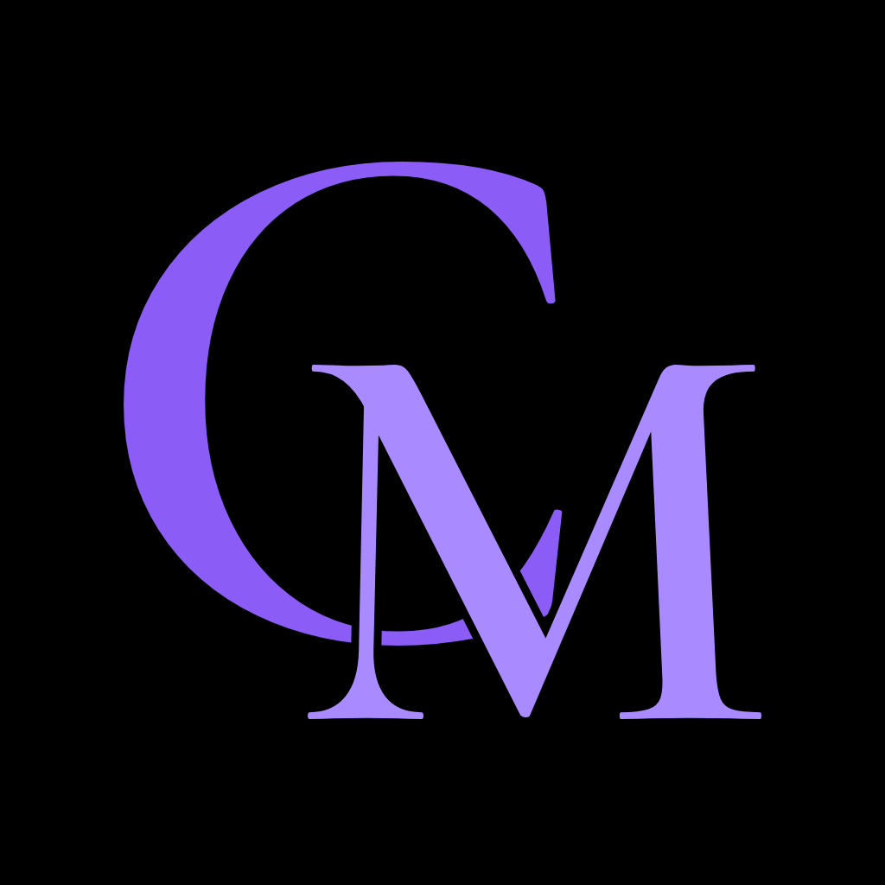

# Brand

## Ownership and license

The **CoryMusic** name, the **CM** monogram and the app icon are © 2026 **sabrinasalomon**.

They are released under the same [MIT License](LICENSE) as the rest of this repository. You may use, copy, modify and distribute them, as long as the copyright and license notice from [LICENSE](LICENSE) is included.

Attribution is appreciated: *"CoryMusic brand by sabrinasalomon"*.

## Assets

| File | Description |
|---|---|
| `design/icon/CoryMusic.icon` | Layered app icon for Icon Composer / Xcode 26 |
| `design/icon/source/cm-c.svg` | "C" layer, purple |
| `design/icon/source/cm-m.svg` | "M" layer, light purple |
| `design/icon/source/cm-c-mono.svg` | "C" layer, white (tinted and clear appearances) |
| `design/icon/source/cm-m-mono.svg` | "M" layer, white (tinted and clear appearances) |
| `design/icon/source/cm-monogram-preview.svg` | Flat monogram on black |
| `design/icon/export/AppIcon-1024.png` | Flattened 1024 × 1024 preview |

## Colors

| Name | Hex |
|---|---|
| Black | `#000000` |
| Monogram C | `#8B5CF6` |
| Monogram M / accent | `#A98BFF` |
| Primary | `#7C3AED` |

See [docs/DESIGN.md](docs/DESIGN.md) for the complete palette.

## Typeface credit

The monogram letterforms were drawn from outlines of **Cormorant Garamond SemiBold** by Christian Thalmann, licensed under the [SIL Open Font License 1.1](https://openfontlicense.org). The font itself is not included in this repository; the OFL allows artwork and logos created with the font to be distributed under any license.
