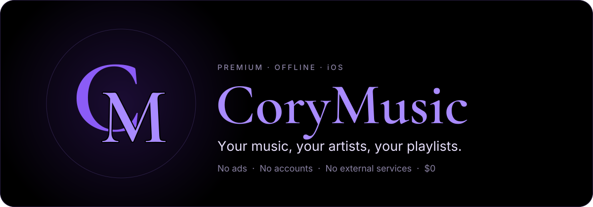
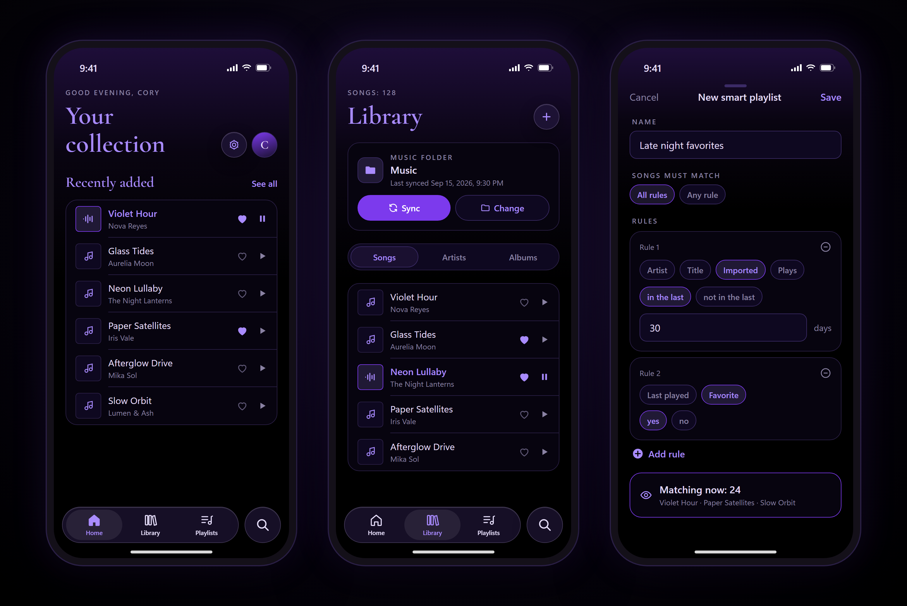
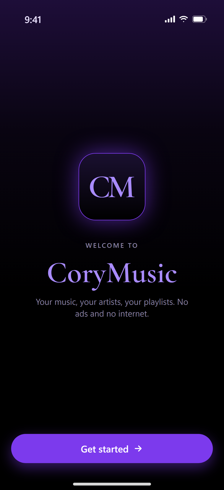
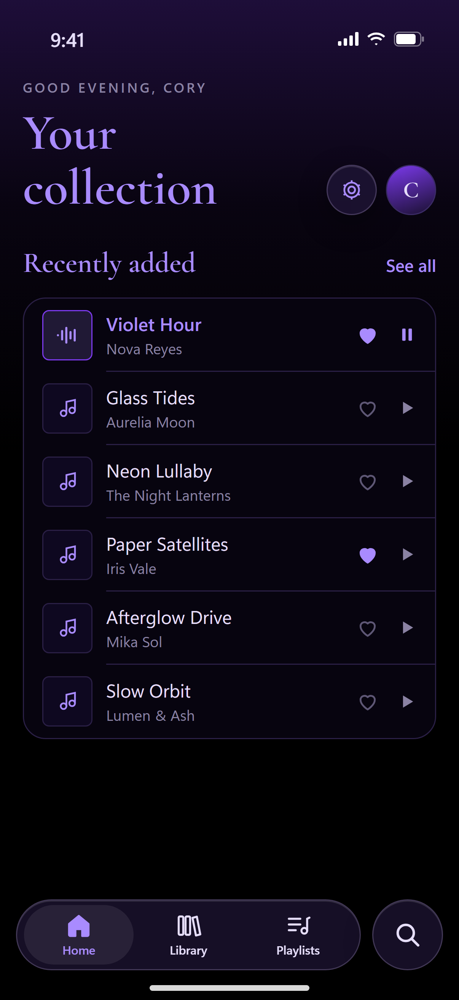
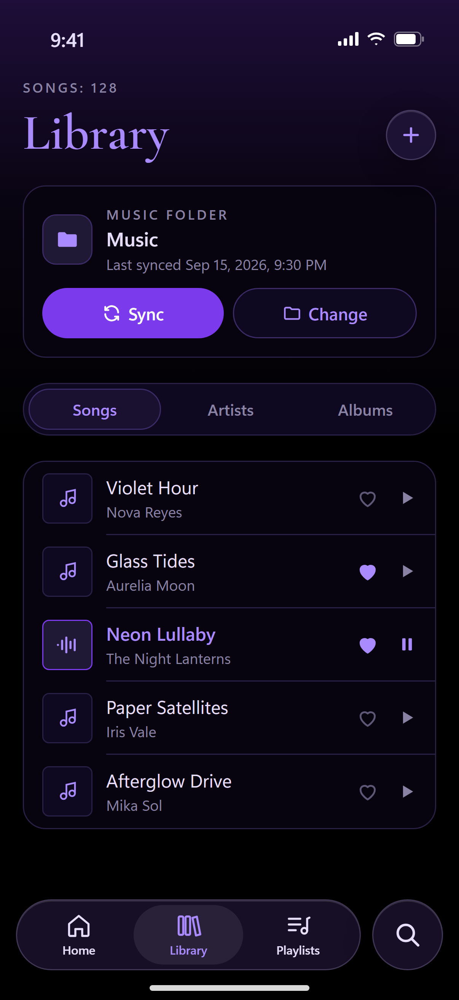
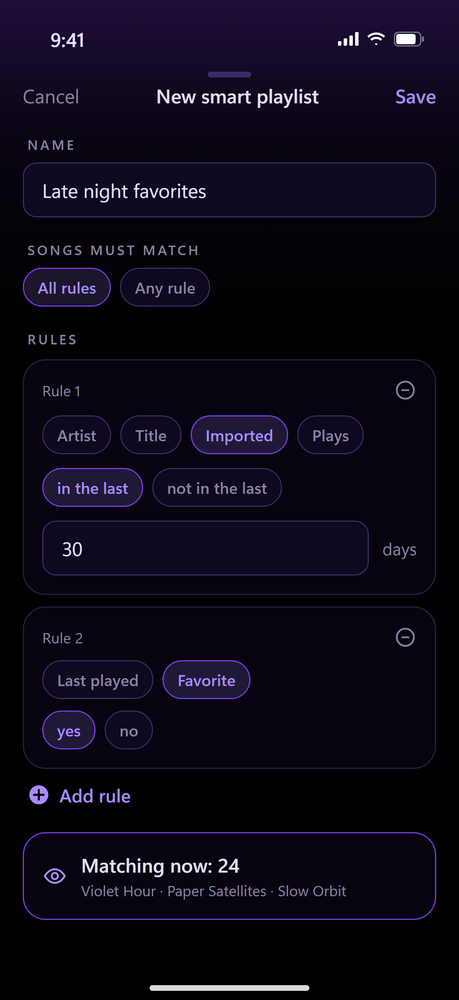
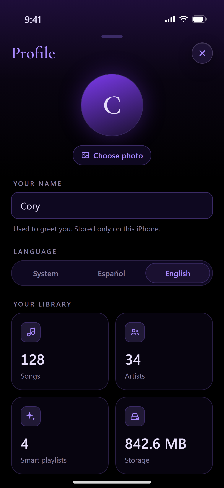

<p align="center">
  <a href="https://sabrinasalomon.github.io/CoryMusic/">
    
  </a>
</p>

<p align="center">
  
  
  
  
  
  
  
</p>

<p align="center">
  <a href="https://sabrinasalomon.github.io/CoryMusic/">
    
  </a>
</p>

<p align="center">
  
</p>

**CoryMusic** is a free iOS music player with a pure-black, purple, Liquid Glass look. Import the songs you already have, keep a music folder in sync, and let **smart playlists** organize your library for you — no ads, no accounts, no internet.

> **Status:** in active development. You can try it today on your iPhone with Expo Go.

## 

<table>
  <tr>
    <td align="center" width="20%"><br><sub><b>Welcome</b><br>Greets you by name</sub></td>
    <td align="center" width="20%"><br><sub><b>Home</b><br>Recently added</sub></td>
    <td align="center" width="20%"><br><sub><b>Library</b><br>Music folder sync</sub></td>
    <td align="center" width="20%"><br><sub><b>Smart playlists</b><br>Rules and live preview</sub></td>
    <td align="center" width="20%"><br><sub><b>Profile</b><br>Photo, language, stats</sub></td>
  </tr>
</table>

## 

| Principle | What it means |
|---|---|
| **Zero cost** | Free for you and for everyone who uses it |
| **No external services** | The app makes no network requests — no streaming, no metadata APIs, no analytics |
| **No ads** | Never |
| **Offline-first** | Everything works without internet |
| **Private** | Your library, name and photo never leave your iPhone |
| **Legal** | Plays only files you have the right to use; no audio in this repository |

## 

### Available now

| Area | What you can do |
|---|---|
| **Welcome** | Enter your name and get a greeting based on the time of day |
| **Import** | Pick songs from the Files app (MP3, M4A, AAC, WAV, AIFF, FLAC); duplicates are skipped and `.ogg` files are flagged |
| **Music folder** | Choose a folder such as OneDrive › Music and sync new songs, including subfolders; change or forget it anytime |
| **Library** | Songs and artists, artist and title read from the file name |
| **Now Playing** | Full-screen player with a draggable progress bar, next, previous, shuffle, repeat, queue and sleep timer; mini player above the tab bar; Play and Shuffle for your library and smart playlists |
| **Favorites and plays** | Mark favorites with a heart; plays are counted after half the song |
| **Smart playlists** | Rules by artist, title, import date, plays, last played and favorite; match all or any; sort, limit and live preview; four one-tap suggestions |
| **Profile** | Photo from your gallery, name, in-app language (System, Español, English) and library stats |
| **Backup** | Save a backup to Files or OneDrive, automatic weekly backups on the iPhone (keeps 5), restore playlists, favorites, plays and profile; songs not imported yet get their data back later |
| **Installed app** | Install the Release app on your own iPhone to use it without a computer, with background audio and Lock Screen controls — see [Install on iPhone](docs/INSTALL_IPHONE.md) |
| **Design** | Native iOS 26 tab bar with Liquid Glass, SF Symbols, haptics, English and Spanish |

### Coming next

| Area | Planned |
|---|---|
| **Playback** | Lyrics and a fade-out when the sleep timer ends |
| **Metadata** | Albums and artwork from file tags, review queue, on-device suggestions |
| **Library** | Album pages, search results, normal playlists, delete with confirmation |
| **Entrada folder** | Automatic import from CoryMusic's own folder in Files |

## 

You need a computer with **Node.js 20+** and **Git**, plus an **iPhone with iOS 26** and the free **Expo Go** app, both on the same Wi-Fi.

```bash
git clone https://github.com/sabrinasalomon/CoryMusic.git
cd CoryMusic/mobile
npm install
npx expo start --lan
```

Scan the QR code with the iPhone camera and open it in **Expo Go**. Step-by-step instructions and troubleshooting are in [docs/SETUP.md](docs/SETUP.md).

## 

Pure black background, purple accents, serif titles and Apple's Liquid Glass on the floating controls, with a glass purple **CM** monogram as the app icon. See [docs/DESIGN.md](docs/DESIGN.md) and [BRAND.md](BRAND.md).

## 

| Layer | Technology |
|---|---|
| Framework | Expo SDK 57 · React Native · TypeScript |
| Navigation | Expo Router with native iOS tabs (Liquid Glass) |
| Look and feel | expo-glass-effect · expo-symbols (SF Symbols) · expo-linear-gradient · expo-haptics |
| Data | expo-sqlite (library and smart playlists) · SQLite key-value store (profile and settings) |
| Files | expo-file-system · expo-document-picker · expo-image-picker · expo-sharing |
| Audio | expo-audio (queue, background playback and Lock Screen controls in the installed app) |
| Languages | i18next · expo-localization — English and Spanish |
| Network | None |

## 

The full documentation is also available as a website: **[sabrinasalomon.github.io/CoryMusic](https://sabrinasalomon.github.io/CoryMusic/)**.

| Document | Contents |
|---|---|
| [Requirements](docs/REQUIREMENTS.md) | What you need, requirements and implementation status |
| [Design](docs/DESIGN.md) | Palette, typography, Liquid Glass rules, screens, icon |
| [Architecture](docs/ARCHITECTURE.md) | App structure, modules and sequence diagrams |
| [Data Model](docs/DATA_MODEL.md) | SQLite tables, settings keys and smart playlist rules |
| [User Flows](docs/USER_FLOWS.md) | Screen map and main flows |
| [Music Sources](docs/MUSIC_SOURCES.md) | Where to find free, legal music |
| [Setup](docs/SETUP.md) | Run the app with Expo Go and troubleshooting |
| [Install on iPhone](docs/INSTALL_IPHONE.md) | Install the real app so it works without a computer |
| [Roadmap](docs/ROADMAP.md) | What's done and what's next |
| [Brand](BRAND.md) | Name, monogram and icon usage |

## 

```text
CoryMusic/
├── .github/workflows/        # Documentation site deployment
├── design/
│   ├── icon/                 # CoryMusic.icon, source SVG layers, PNG export
│   ├── readme/               # README banner and section headers
│   └── screenshots/          # App screens used in this README
├── docs/                     # Documentation and diagrams
├── mobile/                   # The Expo app
│   ├── app/                  # Screens (Expo Router): tabs, welcome, now playing, queue, profile, settings, backup, smart playlists
│   ├── assets/               # App icon
│   └── src/
│       ├── backup/           # Backup format, save, share and restore
│       ├── components/       # Screen, buttons, cards, track rows, avatar
│       ├── i18n/             # English and Spanish strings
│       ├── library/          # SQLite, file import, folder sync
│       ├── smart/            # Smart playlist rules engine
│       ├── state/            # Profile, library, backup and player providers
│       ├── storage/          # Key-value settings
│       └── theme/            # Design tokens
├── playlists/                # Backup format example (no audio)
├── scripts/                  # Helper scripts for the installed app
└── site/                     # Documentation website (GitHub Pages)
```

## 

This repository contains **code, documentation and brand assets only**. Audio files are never committed. CoryMusic plays files you have the right to use — see [Music Sources](docs/MUSIC_SOURCES.md) for free, legal places to find music.

## 

Code, documentation and brand assets (the CoryMusic name, CM monogram and app icon) are released under the [MIT License](LICENSE) © 2026 sabrinasalomon. See [BRAND.md](BRAND.md) for details.
