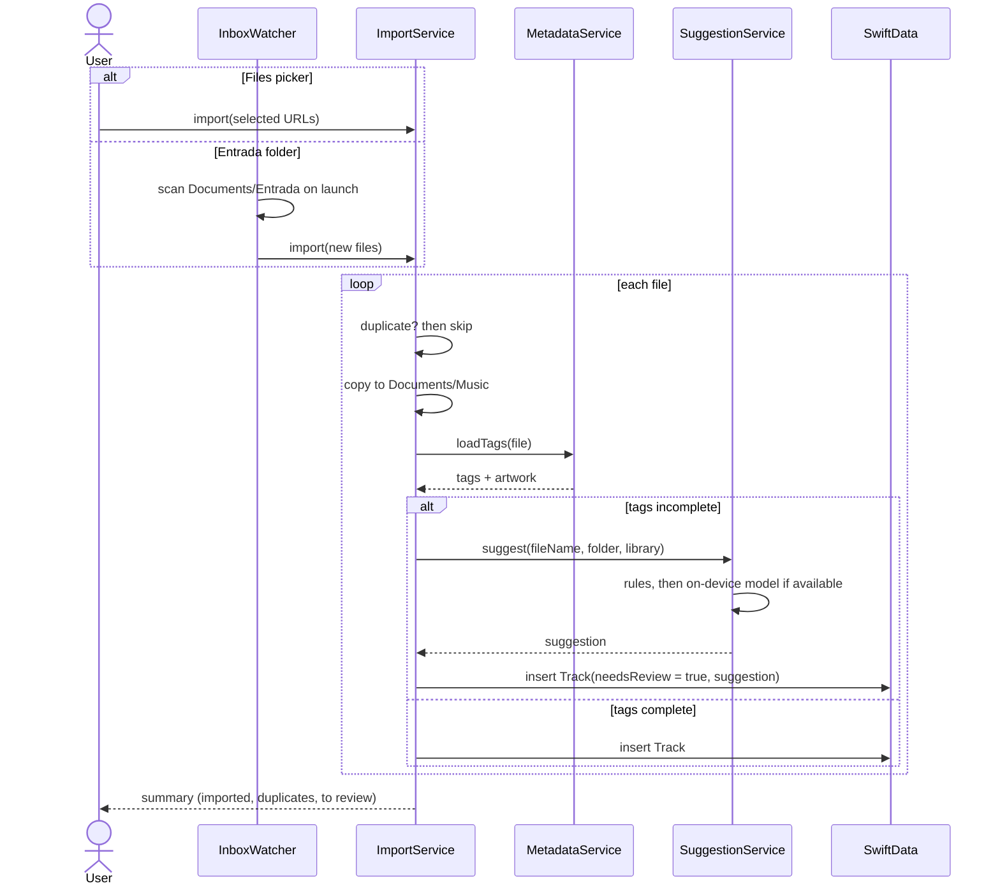
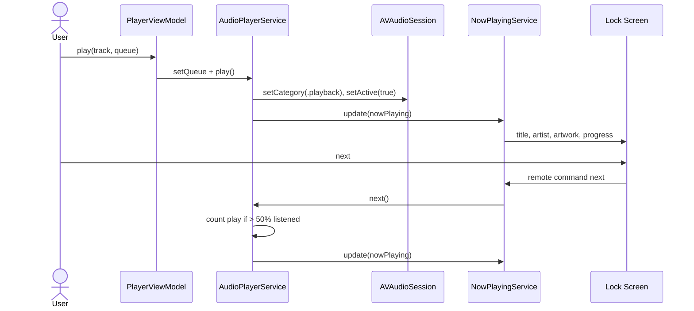
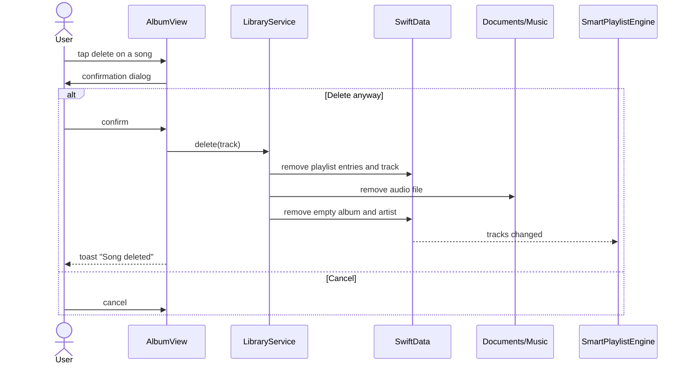
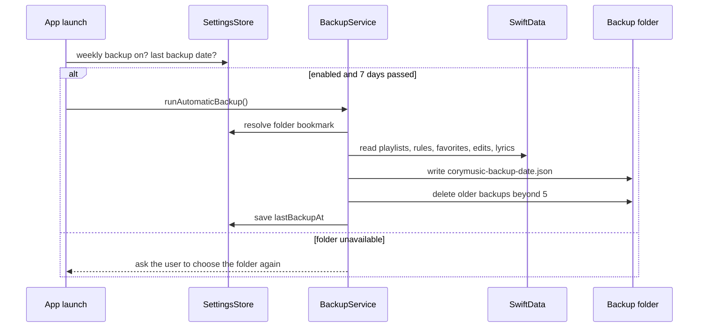
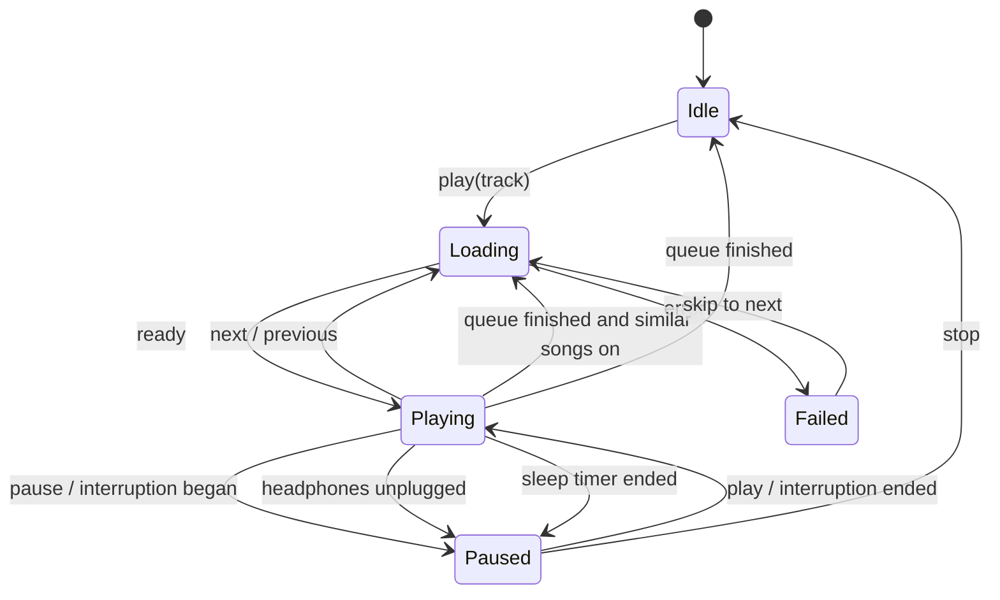

# Architecture

CoryMusic follows **MVVM + Services**. Views are thin, ViewModels hold screen state, Services own side effects. Everything runs on-device: **the app contains no networking code**.

## 1. Layer overview

```mermaid
flowchart TB
    subgraph UI["Presentation — SwiftUI + Liquid Glass"]
        V0[WelcomeView]
        V1[HomeView]
        V2[LibraryView / AlbumView / ArtistView]
        V3[PlaylistsView / SmartPlaylistEditorView]
        V4[NowPlayingView / QueueView / LyricsView]
        V5[SearchView]
        V6[MetadataReviewView]
        V7[SettingsView / BackupView]
    end

    subgraph VM["ViewModels — @Observable"]
        VM0[OnboardingViewModel]
        VM1[LibraryViewModel]
        VM2[PlaylistViewModel]
        VM3[PlayerViewModel]
        VM4[SearchViewModel]
        VM5[MetadataReviewViewModel]
        VM6[SettingsViewModel]
    end

    subgraph SV["Services"]
        S1[AudioPlayerService]
        S2[NowPlayingService]
        S3[ImportService]
        S4[InboxWatcher]
        S5[MetadataService]
        S6[SuggestionService]
        S7[SmartPlaylistEngine]
        S8[SearchService]
        S9[BackupService]
        S10[LibraryService]
        S11[SettingsStore]
    end

    subgraph DATA["On-device data"]
        D1[(SwiftData store)]
        D2[/Documents/Music/]
        D3[/Documents/Entrada/]
        D4[(UserDefaults)]
        D5[/Backup folder chosen by user/]
    end

    V0 --> VM0
    V1 & V2 --> VM1
    V3 --> VM2
    V4 --> VM3
    V5 --> VM4
    V6 --> VM5
    V7 --> VM6

    VM0 --> S11
    VM1 --> S3
    VM1 --> S10
    VM2 --> S7
    VM3 --> S1
    VM4 --> S8
    VM5 --> S6
    VM6 --> S9
    VM6 --> S11

    S1 --> S2
    S4 --> S3
    S3 --> S5
    S3 --> S6
    S3 --> D2
    S4 --> D3
    S3 --> D1
    S10 --> D1
    S10 --> D2
    S7 --> D1
    S8 --> D1
    S9 --> D1
    S9 --> D5
    S11 --> D4
```

## 2. Services

| Service | Responsibility |
|---|---|
| **AudioPlayerService** | Wraps `AVPlayer`; queue, play/pause/seek, shuffle/repeat; sleep timer with fade-out; continue with similar songs when the queue ends; `AVAudioSession(.playback)`; interruptions and route changes; counts a play after 50% listened |
| **NowPlayingService** | `MPNowPlayingInfoCenter` (title, artist, artwork, progress) and `MPRemoteCommandCenter` handlers |
| **ImportService** | Copies files into `Documents/Music/`, detects duplicates, creates `Track`/`Artist`/`Album`, marks incomplete tracks `needsReview` |
| **InboxWatcher** | On launch/foreground, scans `Documents/Entrada/` and sends new files to `ImportService` (toggle in Settings) |
| **MetadataService** | Loads tags and artwork asynchronously from `AVURLAsset` |
| **SuggestionService** | Filename patterns, noise cleanup, folder hints, fuzzy match to existing artists; **Foundation Models** on-device model for messy names when available, rules otherwise |
| **SmartPlaylistEngine** | Translates rules into predicates, evaluates matching tracks, applies sort and limit; re-evaluated when tracks change |
| **SearchService** | Case- and accent-insensitive search across artists, albums, tracks, playlists; ranks a top result |
| **LibraryService** | Deletes tracks after confirmation: removes playlist entries, the `Track` record, the audio file, and orphaned albums/artists |
| **BackupService** | Encodes/decodes JSON backups; weekly automatic backup to the user-chosen folder via a security-scoped bookmark; keeps the 5 most recent; restore report with pending songs |
| **SettingsStore** | Typed wrapper over `UserDefaults` (`@AppStorage`) for name, toggles, default timer and backup state |

## 3. Sequence — import with suggestions

## 4. Sequence — background playback

## 5. Sequence — delete a song

## 6. Sequence — weekly automatic backup

## 7. Playback state machine

## 8. Key technical decisions

| Decision | Choice | Reason |
|---|---|---|
| UI | SwiftUI + Liquid Glass (iOS 26) | Native premium look, less code |
| Minimum iOS | **26** | Liquid Glass APIs (`glassEffect`, `tabViewBottomAccessory`) |
| Persistence | SwiftData; settings in `UserDefaults` | Native, on-device, survives re-installs |
| Audio storage | Copy into sandbox | Files stay available after re-install |
| Metadata edits | Stored in database, original file untouched | Safe; no risk of corrupting files |
| Deletion | Always confirmed; removes file from storage | Frees space; avoids accidents |
| Backups | Outside the app, user-chosen folder | Survive deleting the app |
| Networking | **None** | No external services, privacy, zero cost |
| AI suggestions | Foundation Models in v1.0, rules fallback | On-device, free, private |
| Localization | String Catalog, English base + Spanish | Standard Xcode workflow |
| Dependencies | None | Nothing to maintain or pay for |

## 9. Capabilities & Info.plist

| Setting | Value | Why |
|---|---|---|
| Background Modes | Audio, AirPlay, and Picture in Picture | Keep playing when locked |
| `UIFileSharingEnabled` | `YES` | Show the app folder (Music, Entrada) in Files and Finder |
| `LSSupportsOpeningDocumentsInPlace` | `YES` | Open and export backups in Files |
| Localizations | English, Spanish | Project → Info → Localizations |
