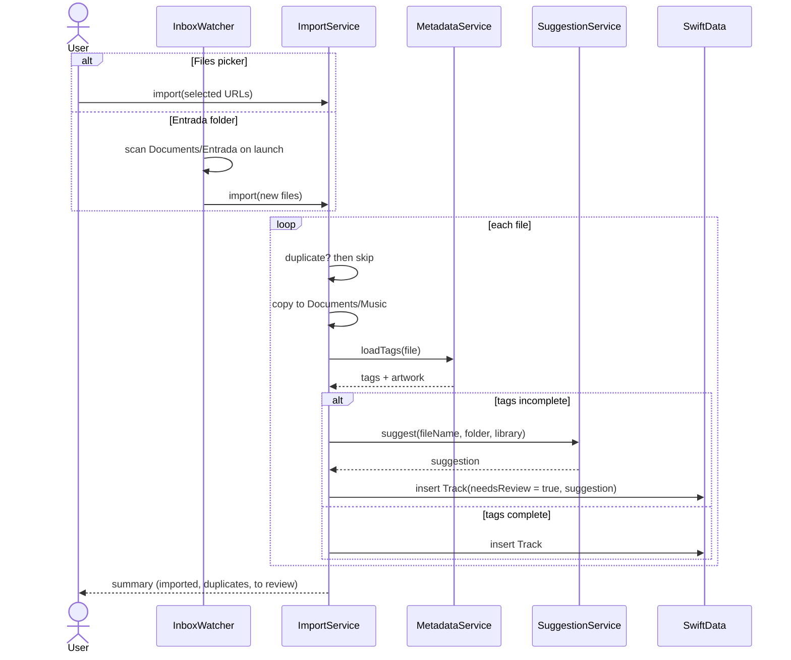
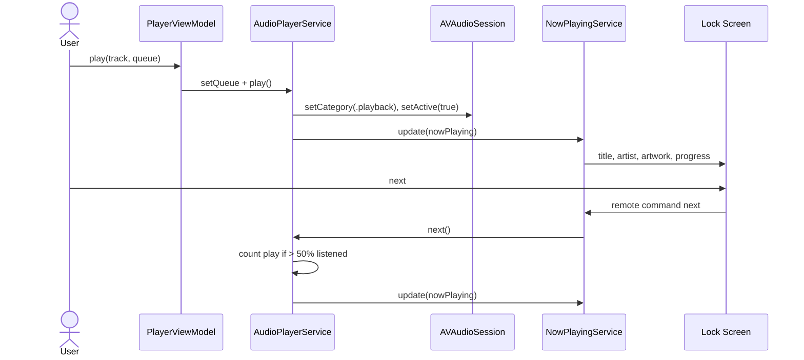
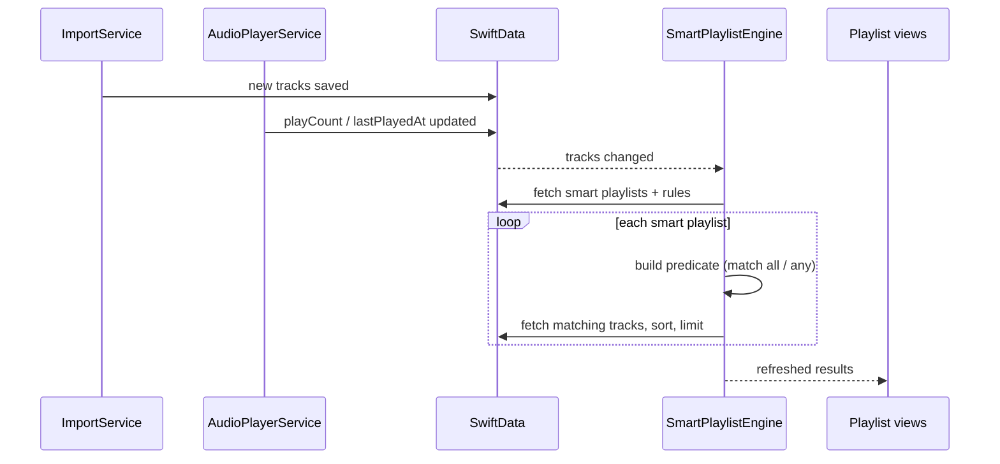
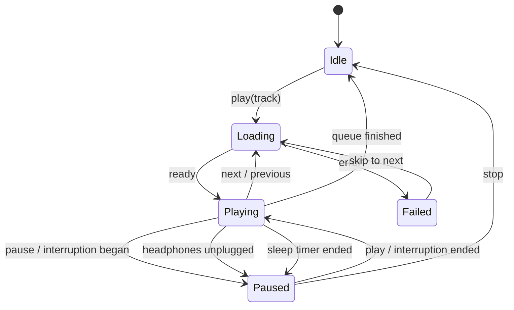

# Architecture

CoryMusic follows **MVVM + Services**. Views are thin, ViewModels hold screen state, Services own side effects. Everything runs on-device: **the app contains no networking code**.

## 1. Layer overview

```mermaid
flowchart TB
    subgraph UI["Presentation — SwiftUI + Liquid Glass"]
        V1[HomeView]
        V2[LibraryView]
        V3[ArtistView]
        V4[PlaylistsView]
        V5[SmartPlaylistEditorView]
        V6[NowPlayingView / QueueView]
        V7[SearchView]
        V8[MetadataReviewView]
        V9[SettingsView]
    end

    subgraph VM["ViewModels — @Observable"]
        VM1[LibraryViewModel]
        VM2[PlaylistViewModel]
        VM3[PlayerViewModel]
        VM4[SearchViewModel]
        VM5[MetadataReviewViewModel]
        VM6[SettingsViewModel]
    end

    subgraph SV["Services"]
        S1[AudioPlayerService]
        S2[NowPlayingService]
        S3[ImportService]
        S4[InboxWatcher]
        S5[MetadataService]
        S6[SuggestionService]
        S7[SmartPlaylistEngine]
        S8[SearchService]
        S9[BackupService]
    end

    subgraph DATA["On-device data"]
        D1[(SwiftData store)]
        D2[/Documents/Music/]
        D3[/Documents/Entrada/]
    end

    V1 & V2 & V3 --> VM1
    V4 & V5 --> VM2
    V6 --> VM3
    V7 --> VM4
    V8 --> VM5
    V9 --> VM6

    VM1 --> S3
    VM1 --> D1
    VM2 --> S7
    VM3 --> S1
    VM4 --> S8
    VM5 --> S6
    VM6 --> S9

    S1 --> S2
    S4 --> S3
    S3 --> S5
    S3 --> S6
    S3 --> D2
    S4 --> D3
    S3 --> D1
    S7 --> D1
    S8 --> D1
    S9 --> D1
```

## 2. Services

| Service | Responsibility |
|---|---|
| **AudioPlayerService** | Wraps `AVPlayer`; queue, play/pause/seek, shuffle/repeat, sleep timer; `AVAudioSession(.playback)`; interruptions and route changes; counts a play after 50% listened |
| **NowPlayingService** | `MPNowPlayingInfoCenter` (title, artist, artwork, progress) and `MPRemoteCommandCenter` handlers |
| **ImportService** | Copies files into `Documents/Music/`, detects duplicates, creates `Track`/`Artist`/`Album`, marks incomplete tracks `needsReview` |
| **InboxWatcher** | On app launch/foreground, scans `Documents/Entrada/` and sends new files to `ImportService` (toggle in Settings) |
| **MetadataService** | Loads tags and artwork asynchronously from `AVURLAsset` |
| **SuggestionService** | Builds suggestions: filename patterns, noise cleanup, folder hints, fuzzy match to existing artists; optionally Foundation Models on capable devices |
| **SmartPlaylistEngine** | Translates rules into predicates, evaluates matching tracks, applies sort and limit; re-evaluated when tracks change |
| **SearchService** | Case- and accent-insensitive search across artists, albums, tracks, playlists; ranks a top result |
| **BackupService** | Encodes/decodes playlists, smart rules, favorites and metadata edits as JSON; restore report |

## 3. Sequence — import with suggestions

## 4. Sequence — background playback

## 5. Sequence — smart playlist update

## 6. Playback state machine

## 7. Key technical decisions

| Decision | Choice | Reason |
|---|---|---|
| UI | SwiftUI + Liquid Glass (iOS 26) | Native premium look, less code |
| Minimum iOS | **26** | Liquid Glass APIs (`glassEffect`, `tabViewBottomAccessory`) |
| Persistence | SwiftData | Native, on-device, survives re-installs |
| Audio storage | Copy into sandbox | Files stay available after re-install |
| Metadata edits | Stored in database, original file untouched | Safe; no risk of corrupting files |
| Networking | **None** | No external services, privacy, zero cost |
| AI suggestions | Foundation Models, optional | On-device and free; rules-based fallback |
| Dependencies | None | Nothing to maintain or pay for |

## 8. Capabilities & Info.plist

| Setting | Value | Why |
|---|---|---|
| Background Modes | Audio, AirPlay, and Picture in Picture | Keep playing when locked |
| `UIFileSharingEnabled` | `YES` | Show the app folder (Music, Entrada, Backups) in Files and Finder |
| `LSSupportsOpeningDocumentsInPlace` | `YES` | Open and export backups in Files |
