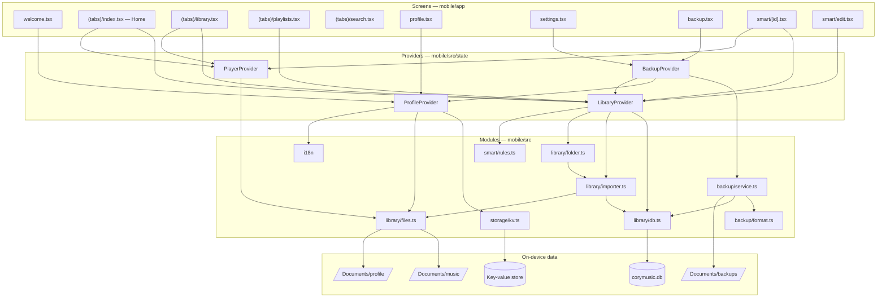
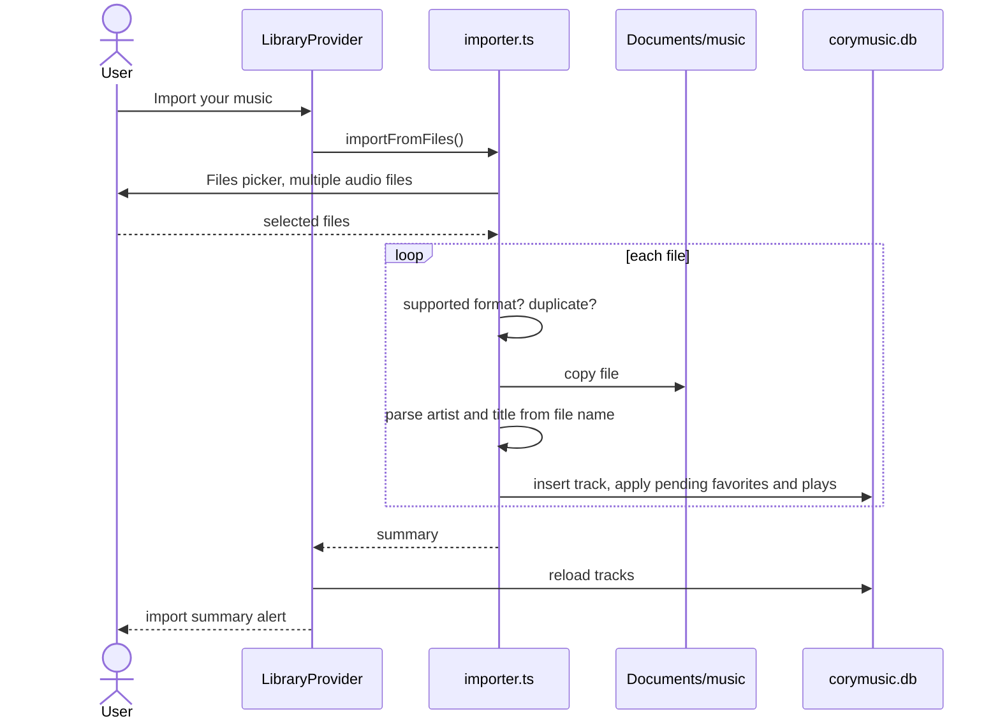
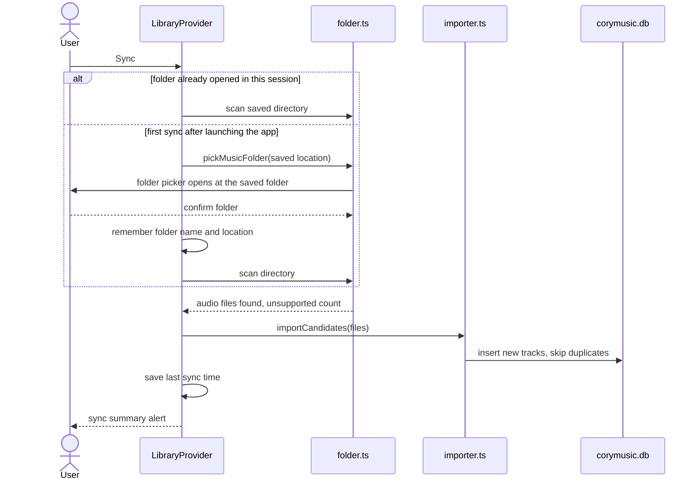
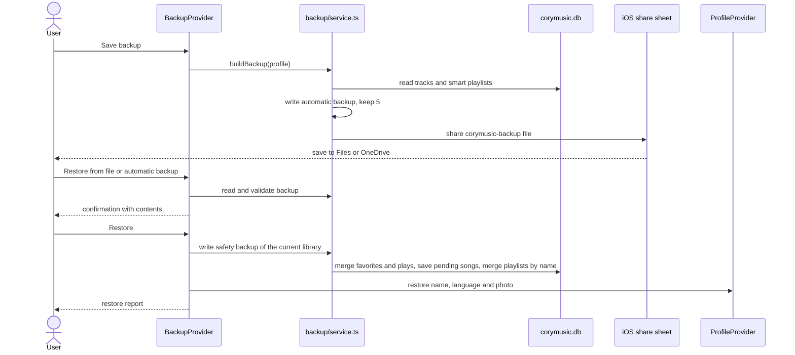
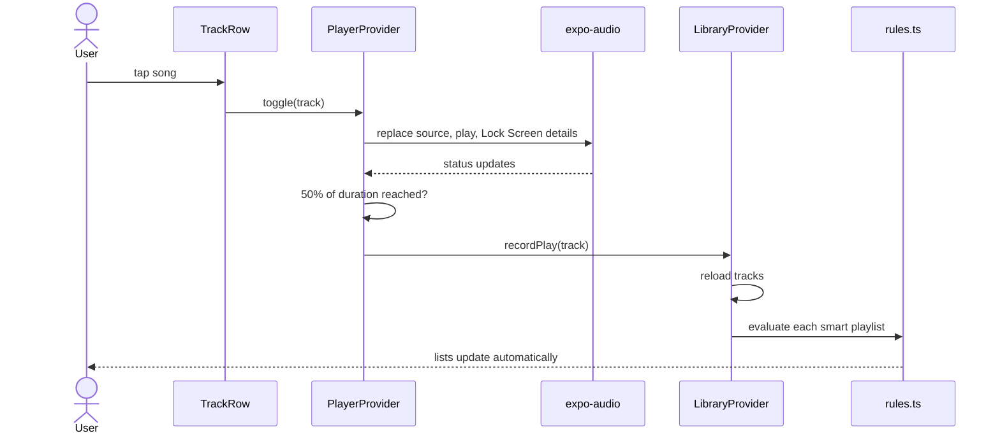

# Architecture

CoryMusic is an **Expo** app (React Native + TypeScript) in the `mobile/` folder. Screens use **Expo Router** file-based routing, shared state lives in four **React context providers**, and all data stays on the device. **The app contains no networking code.**

## 1. Overview

## 2. Providers

Providers are nested in this order: `ProfileProvider` → `LibraryProvider` → `BackupProvider` → `PlayerProvider`.

| Provider | Holds | Main actions |
|---|---|---|
| **ProfileProvider** | Name, photo, language preference, onboarding flag | `setName`, `setPhoto`, `removePhoto`, `setLanguage`, `completeOnboarding` |
| **LibraryProvider** | Tracks, artists, storage used, smart playlists, music folder, sync state | `importMusic`, `syncMusicFolder`, `chooseMusicFolder`, `forgetMusicFolder`, `toggleFavorite`, `recordPlay`, `saveSmartPlaylist`, `deleteSmartPlaylist`, `reload` |
| **BackupProvider** | Automatic backups on the iPhone, last saved backup, weekly setting, pending songs | `saveBackup`, `restoreFromFile`, `restoreSnapshot`, `setAutoWeekly`; creates the weekly automatic backup on launch |
| **PlayerProvider** | Current track and play state | `toggle(track)`; records a play after 50% listened; shows the song on the Lock Screen |

## 3. Modules

| Module | Responsibility |
|---|---|
| `library/db.ts` | Opens `corymusic.db`, creates and migrates tables, reads and writes tracks, smart playlists and pending song data |
| `library/importer.ts` | Files picker, supported format check, duplicate detection, copy into `Documents/music`, file name parsing |
| `library/folder.ts` | Folder picker and recursive scan (up to 5 levels, 5,000 files), counts unsupported audio |
| `library/files.ts` | Paths for music and profile photo, supported extensions, safe delete |
| `smart/rules.ts` | Rule types, allowed conditions per field, validation, evaluation, sorting, presets, rule descriptions |
| `backup/format.ts` | Backup schema (version 1) and strict parsing of backup files |
| `backup/service.ts` | Builds a backup, writes automatic backups (keeps 5), shares a backup file, reads backup files, restores library data |
| `storage/kv.ts` | Typed keys over the SQLite key-value store |
| `i18n` | i18next setup with English and Spanish resources and the saved language preference |
| `theme/tokens.ts` | Colors, typography, radius, spacing |

## 4. Sequence — import from Files

## 5. Sequence — music folder sync

iOS grants access to a picked folder **for the current app session only**, so after relaunching, the picker opens at the saved folder and the user confirms it.

## 6. Sequence — save and restore a backup

## 7. Sequence — playback and smart playlists

## 8. Key technical decisions

| Decision | Choice | Reason |
|---|---|---|
| Framework | Expo SDK 57, React Native, TypeScript | Preview on the iPhone from Windows with Expo Go |
| Navigation | Expo Router, `NativeTabs` | Real iOS 26 tab bar with Liquid Glass and a separate search tab |
| Glass | `expo-glass-effect` with fallback to a plain view | Native glass on iOS 26 |
| Icons | `expo-symbols` | Apple SF Symbols |
| Library data | `expo-sqlite` | Relational data for tracks, playlists and rules |
| Settings | SQLite key-value store | Simple synchronous reads at startup |
| Audio files | Copied into the app's documents folder | Always available offline, independent of the source |
| Smart playlists | Evaluated in memory from rules | Small libraries, always up to date, no stored results |
| Backups outside the app | Saved by the user through the share sheet, with a weekly reminder | iOS doesn't let apps keep writing to an external folder |
| Automatic backups | Inside the app, weekly, 5 kept | Protect against mistakes and failed updates without user action |
| Personal use | Release build installed from a Mac with a free Apple ID | Works without a computer; re-install every 7 days keeps data |
| Networking | None | No external services, privacy, zero cost |

## 9. Expo Go vs. installed app

| Feature | In Expo Go | In the installed app |
|---|---|---|
| Works without the computer | Not available | Available |
| Background audio and Lock Screen details | Not available | Available (`enableBackgroundPlayback`) |
| *Entrada* folder visible in Files | Not available | Planned |
| Remembering folder access across launches | Not available | Not available (would need a custom native module) |

## 10. App configuration

| Setting | Value |
|---|---|
| Name | CoryMusic |
| Bundle identifier | `com.sabrinasalomon.corymusic` |
| Appearance | Dark |
| Config plugins | expo-router, expo-localization, expo-font, expo-status-bar, expo-sqlite, expo-audio (`enableBackgroundPlayback: true`), expo-asset, expo-sharing |
| iOS background modes | `audio` |
