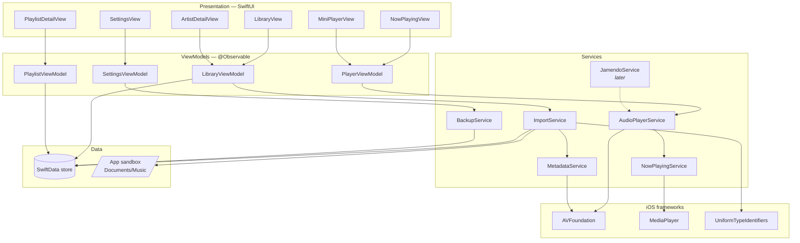
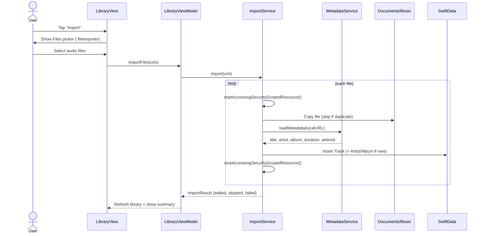
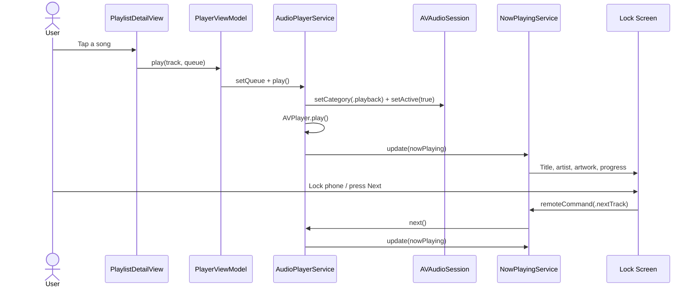
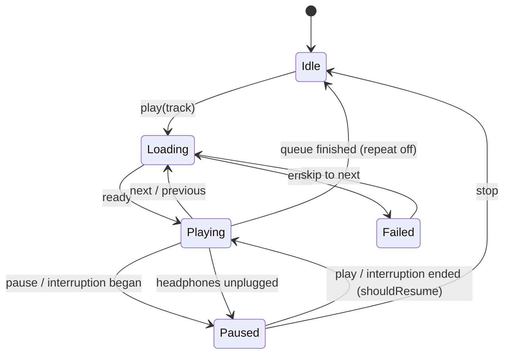

# Architecture

CoryMusic follows **MVVM + Services**. Views are thin, ViewModels hold screen state, and Services own side effects (audio, files, persistence). Everything runs on-device; there is no backend.

## 1. Layer overview

## 2. Responsibilities

| Component | Responsibility |
|---|---|
| **AudioPlayerService** | Wraps `AVPlayer`; queue, play/pause/seek, shuffle/repeat; configures `AVAudioSession` (`.playback`); handles interruptions and route changes |
| **NowPlayingService** | Updates `MPNowPlayingInfoCenter` (title, artist, artwork, progress) and registers `MPRemoteCommandCenter` handlers |
| **ImportService** | Receives URLs from `.fileImporter`, copies files into `Documents/Music/`, avoids duplicates, creates `Track` records |
| **MetadataService** | Loads common metadata and artwork from `AVURLAsset` asynchronously |
| **BackupService** | Encodes playlists + track metadata to JSON and restores them, matching tracks by file name + duration |
| **JamendoService** *(later)* | Searches Creative Commons tracks and returns stream URLs for `AudioPlayerService` |

## 3. Sequence — importing songs

## 4. Sequence — playback in background

## 5. Playback state machine

## 6. Key technical decisions

| Decision | Choice | Reason |
|---|---|---|
| UI framework | SwiftUI | Modern, less code, great for portfolio |
| Persistence | SwiftData | Native, no server, survives re-installs |
| Audio storage | Copy into app sandbox | Files stay available after re-install; no broken bookmarks |
| Backend | None | Zero cost, privacy, offline-first |
| Minimum iOS | 17 | Required by SwiftData and `@Observable` |
| Third-party dependencies | None for MVP | Nothing to maintain or pay for |

## 7. Required capabilities & Info.plist

| Setting | Value | Why |
|---|---|---|
| Background Modes | **Audio, AirPlay, and Picture in Picture** | Keep playing when locked |
| `UIFileSharingEnabled` | `YES` | Show the app folder in Files |
| `LSSupportsOpeningDocumentsInPlace` | `YES` | Open/export backups in Files |
