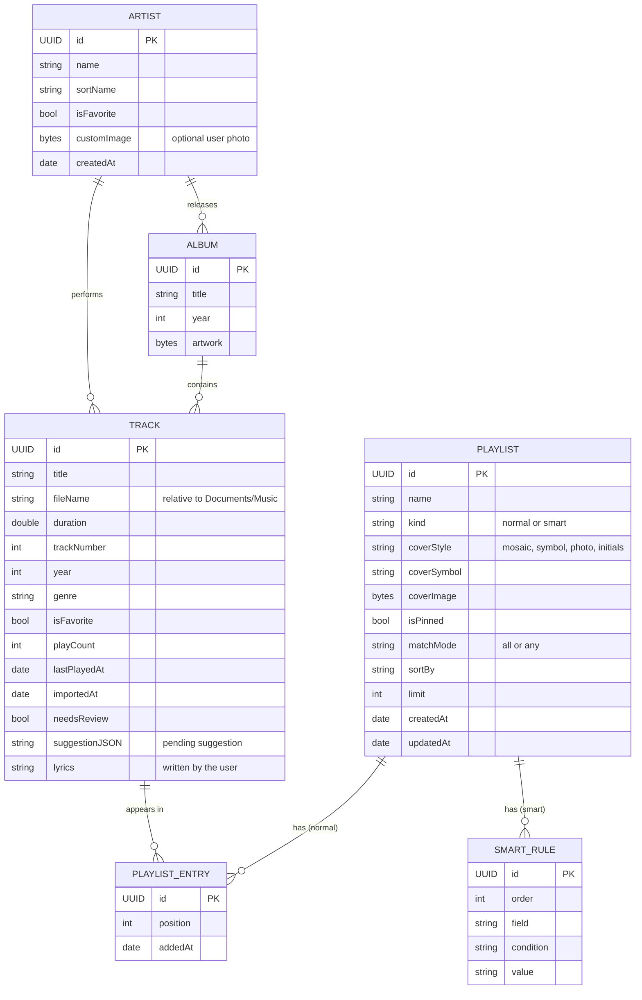

# Data Model

All data lives on the device in a **SwiftData** store; audio files live in `Documents/Music/`. Metadata edits are stored in the database — **original audio files are never modified**.

## 1. Entity-relationship diagram



- `PLAYLIST_ENTRY` stores the **order** of normal playlists; a song can be in many playlists.
- Smart playlists store **rules, not songs** — results are computed by `SmartPlaylistEngine`.

## 2. Smart playlist rules

| Field | Conditions | Value |
|---|---|---|
| `artist`, `album`, `title`, `genre` | is, is not, contains | Text (artist picked from library) |
| `year` | is, before, after, between | Year |
| `importedAt`, `lastPlayedAt` | in the last, not in the last | Days / weeks / months |
| `playCount` | greater than, less than | Number |
| `duration` | longer than, shorter than | Minutes |
| `isFavorite` | is | Yes / No |
| `artistIsFavorite` | is | Yes / No |

| Option | Values |
|---|---|
| Match | All rules · Any rule |
| Sort | Recently added · Most played · A–Z · Year · Random |
| Limit | None or N songs |

Example — **Lo nuevo de [Artista]**: `artist is "Artist Name"` AND `importedAt in the last 30 days`, sorted by recently added.

## 3. SwiftData models (sketch)

```swift
import Foundation
import SwiftData

@Model
final class Artist {
    @Attribute(.unique) var id: UUID
    var name: String
    var sortName: String
    var isFavorite: Bool
    @Attribute(.externalStorage) var customImage: Data?
    var createdAt: Date
    @Relationship(inverse: \Track.artist) var tracks: [Track] = []
    @Relationship(inverse: \Album.artist) var albums: [Album] = []

    init(name: String) {
        self.id = UUID()
        self.name = name
        self.sortName = name
        self.isFavorite = false
        self.createdAt = .now
    }
}

@Model
final class Album {
    @Attribute(.unique) var id: UUID
    var title: String
    var year: Int?
    @Attribute(.externalStorage) var artwork: Data?
    var artist: Artist?
    @Relationship(inverse: \Track.album) var tracks: [Track] = []

    init(title: String, artist: Artist?) {
        self.id = UUID()
        self.title = title
        self.artist = artist
    }
}

@Model
final class Track {
    @Attribute(.unique) var id: UUID
    var title: String
    var fileName: String
    var duration: Double
    var trackNumber: Int?
    var year: Int?
    var genre: String?
    var isFavorite: Bool
    var playCount: Int
    var lastPlayedAt: Date?
    var importedAt: Date
    var needsReview: Bool
    var suggestionJSON: String?
    var lyrics: String?
    var artist: Artist?
    var album: Album?
    @Relationship(deleteRule: .cascade, inverse: \PlaylistEntry.track) var entries: [PlaylistEntry] = []

    init(title: String, fileName: String, duration: Double) {
        self.id = UUID()
        self.title = title
        self.fileName = fileName
        self.duration = duration
        self.isFavorite = false
        self.playCount = 0
        self.importedAt = .now
        self.needsReview = false
    }
}

enum PlaylistKind: String, Codable { case normal, smart }
enum CoverStyle: String, Codable { case mosaic, symbol, photo, initials }
enum MatchMode: String, Codable { case all, any }

@Model
final class Playlist {
    @Attribute(.unique) var id: UUID
    var name: String
    var kindRaw: String
    var coverStyleRaw: String
    var coverSymbol: String?
    @Attribute(.externalStorage) var coverImage: Data?
    var isPinned: Bool
    var matchModeRaw: String
    var sortBy: String
    var limit: Int?
    var createdAt: Date
    var updatedAt: Date
    @Relationship(deleteRule: .cascade, inverse: \PlaylistEntry.playlist) var entries: [PlaylistEntry] = []
    @Relationship(deleteRule: .cascade, inverse: \SmartRule.playlist) var rules: [SmartRule] = []

    var kind: PlaylistKind { PlaylistKind(rawValue: kindRaw) ?? .normal }

    init(name: String, kind: PlaylistKind) {
        self.id = UUID()
        self.name = name
        self.kindRaw = kind.rawValue
        self.coverStyleRaw = CoverStyle.mosaic.rawValue
        self.isPinned = false
        self.matchModeRaw = MatchMode.all.rawValue
        self.sortBy = "recentlyAdded"
        self.createdAt = .now
        self.updatedAt = .now
    }
}

@Model
final class PlaylistEntry {
    @Attribute(.unique) var id: UUID
    var position: Int
    var addedAt: Date
    var playlist: Playlist?
    var track: Track?

    init(position: Int, playlist: Playlist, track: Track) {
        self.id = UUID()
        self.position = position
        self.addedAt = .now
        self.playlist = playlist
        self.track = track
    }
}

@Model
final class SmartRule {
    @Attribute(.unique) var id: UUID
    var order: Int
    var field: String
    var condition: String
    var value: String
    var playlist: Playlist?

    init(order: Int, field: String, condition: String, value: String) {
        self.id = UUID()
        self.order = order
        self.field = field
        self.condition = condition
        self.value = value
    }
}
```

## 4. File storage

```text
<App sandbox>/
└── Documents/                       ← visible in Files and Finder
    ├── Entrada/                     ← drop files here for automatic import
    ├── Music/                       ← imported audio (managed by the app)
    └── Backups/
        └── corymusic-backup-2026-09-14.json
```

- `fileName` is **relative**; the sandbox path can change between installs.
- Duplicate = same file name **and** duration (± 1 s).

## 5. Backup format (JSON, schemaVersion 1)

Metadata only — never audio. Restore matches tracks by `fileName` + `duration`.

```json
{
  "app": "CoryMusic",
  "schemaVersion": 1,
  "exportedAt": "2026-09-14T18:30:00Z",
  "favoriteArtists": ["Artist Name"],
  "tracks": [
    {
      "fileName": "artist-name - song-title.mp3",
      "duration": 215.4,
      "title": "Song Title",
      "artist": "Artist Name",
      "album": "Album Title",
      "year": 2026,
      "isFavorite": true,
      "playCount": 12,
      "lyrics": null
    }
  ],
  "playlists": [
    {
      "name": "Mis favoritas",
      "kind": "normal",
      "isPinned": true,
      "cover": { "style": "symbol", "symbol": "heart.fill" },
      "tracks": ["artist-name - song-title.mp3"]
    },
    {
      "name": "Lo nuevo de Artist Name",
      "kind": "smart",
      "matchMode": "all",
      "sortBy": "recentlyAdded",
      "limit": null,
      "rules": [
        { "field": "artist", "condition": "is", "value": "Artist Name" },
        { "field": "importedAt", "condition": "inTheLast", "value": "30d" }
      ]
    }
  ]
}
```

Template: [`playlists/my-playlist.example.json`](../playlists/my-playlist.example.json).
