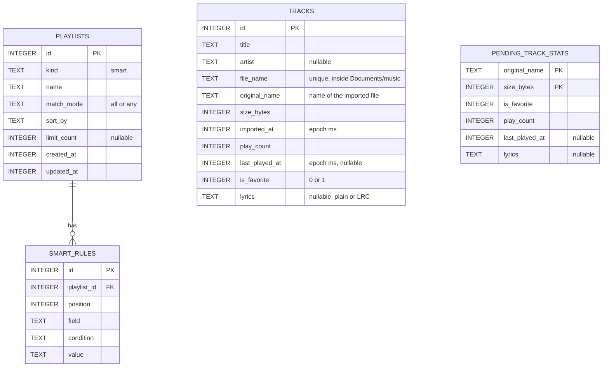

# Data Model

All data lives on the iPhone:

| Where | What |
|---|---|
| `corymusic.db` (SQLite) | Tracks, smart playlists, their rules and pending song data from backups |
| SQLite key-value store | Profile, language, onboarding flag, music folder, backup settings |
| `Documents/music/` | Copies of imported audio files |
| `Documents/profile/` | Profile photo |
| `Documents/backups/` | Automatic backups (the 5 most recent) |

## 1. Entity-relationship diagram



- Smart playlists store **rules, not songs**. Results are computed in `mobile/src/smart/rules.ts` every time tracks change.
- A song is identified across imports and backups by its **original file name + size**. The same pair is used to skip duplicates.
- `tracks.lyrics` holds lyrics typed or pasted by the user. Lines with times like `[01:23.45]` are read as synced lyrics by `mobile/src/lyrics/lrc.ts`.
- `PENDING_TRACK_STATS` keeps favorites, plays and lyrics from a restored backup for songs that aren't imported yet. When the song is imported, its data is merged and the pending row is removed.
- Deleting a playlist removes its rules; songs stay in the library.

## 2. Schema migrations

`library/db.ts` creates the tables if they don't exist and adds new columns to databases created by earlier versions: `play_count`, `last_played_at`, `is_favorite` and `lyrics` on `tracks`, and `lyrics` on `pending_track_stats`.

## 3. Smart playlist rules

| Field | Conditions | Value |
|---|---|---|
| `artist` | is, is not, contains | Text (accent- and case-insensitive) |
| `title` | contains, is, is not | Text |
| `importedAt` | in the last, not in the last | Days |
| `playCount` | more than, fewer than | Number |
| `lastPlayedAt` | not in the last, in the last | Days (never played counts as "not in the last") |
| `favorite` | yes, no | — |

| Option | Values |
|---|---|
| Match | `all` · `any` |
| Sort | `recentlyAdded` · `mostPlayed` · `title` · `artist` · `random` (stable for the day) |
| Limit | none · 25 · 50 · 100 |

### Built-in suggestions

| Suggestion | Rule | Sort | Limit |
|---|---|---|---|
| Recently added | imported in the last 30 days | recently added | — |
| My favorites | favorite is yes | title | — |
| Most played | plays more than 0 | most played | 50 |
| Forgotten | last played not in the last 90 days | random | — |

## 4. Key-value settings

| Key | Value |
|---|---|
| `profile.name` | User name |
| `profile.photoFile` | Photo file name inside `Documents/profile/` |
| `profile.language` | `system`, `es` or `en` |
| `profile.onboardingDone` | `true` after the welcome flow |
| `folder.uri` | Location of the chosen music folder |
| `folder.name` | Folder name shown in the app |
| `folder.lastSyncAt` | Last sync time (epoch ms) |
| `backup.autoWeekly` | `false` when weekly automatic backups are turned off (on by default) |
| `backup.lastAutoAt` | Last automatic backup (epoch ms) |
| `backup.lastExportAt` | Last backup saved through the share sheet (epoch ms) |

## 5. Backup file (schema version 1)

File name: `corymusic-backup-YYYY-MM-DD-HHMMSS.json`. Audio files are **never** included.

```json
{
  "app": "CoryMusic",
  "schemaVersion": 1,
  "exportedAt": "2026-09-15T21:30:00.000Z",
  "profile": {
    "name": "Cory",
    "language": "system",
    "photo": { "base64": "…", "extension": "jpg" }
  },
  "tracks": [
    {
      "originalName": "Nova Reyes - Violet Hour.mp3",
      "sizeBytes": 8412345,
      "title": "Violet Hour",
      "artist": "Nova Reyes",
      "isFavorite": true,
      "playCount": 12,
      "lastPlayedAt": 1789500000000,
      "importedAt": 1789000000000,
      "lyrics": "[00:12.00]First line of the song\n[00:15.50]Second line of the song"
    }
  ],
  "smartPlaylists": [
    {
      "name": "Late night favorites",
      "matchMode": "all",
      "sortBy": "recentlyAdded",
      "limit": null,
      "rules": [
        { "field": "importedAt", "condition": "inLast", "value": "30" },
        { "field": "favorite", "condition": "isTrue", "value": "" }
      ]
    }
  ]
}
```

### Restore rules

| Data | What happens |
|---|---|
| Safety | A backup of the current library is written first |
| Profile | Name (when present), language and photo are restored |
| Songs already in the app | Favorites are kept if either side has them; the higher play count and the most recent last played date win; lyrics are restored only if the song has none |
| Songs not in the app | Favorites, plays and lyrics are saved as pending and applied when the song is imported |
| Older backups | `lyrics` is optional, so backups made before lyrics existed still restore |
| Smart playlists | A playlist with the same name is updated; others are added |
| Invalid files | Rejected: the file must say `"app": "CoryMusic"` and `"schemaVersion": 1` |

A ready-to-read example lives in [`playlists/my-playlist.example.json`](../playlists/my-playlist.example.json).

## 6. Planned additions

| Addition | Purpose |
|---|---|
| `albums` table and artwork | Album pages and covers from file tags |
| `tracks.needs_review`, suggestion data | *To review* queue |
| Normal playlists with ordered entries | Hand-made playlists |
