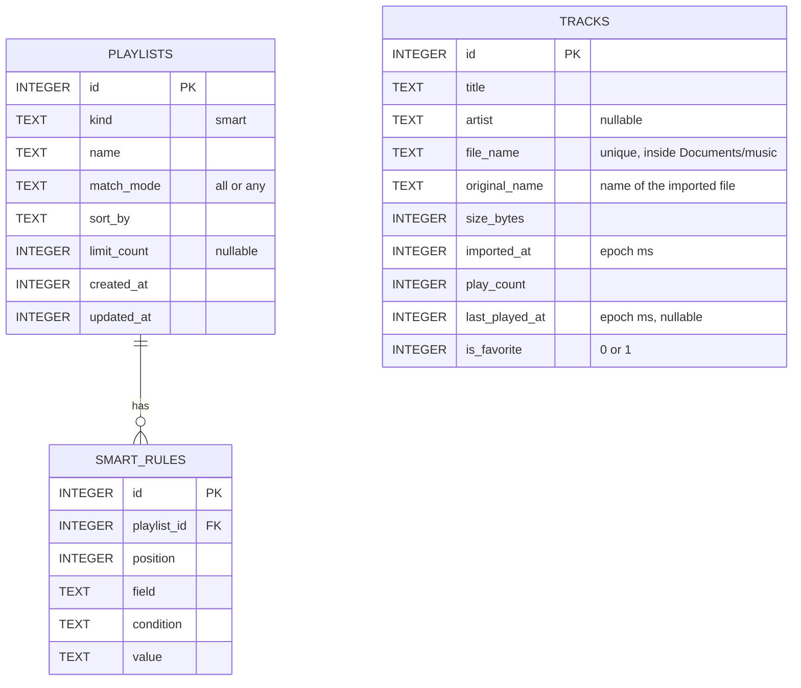

# Data Model

All data lives on the iPhone:

| Where | What |
|---|---|
| `corymusic.db` (SQLite) | Tracks, smart playlists and their rules |
| SQLite key-value store | Profile, language, onboarding flag, music folder |
| `Documents/music/` | Copies of imported audio files |
| `Documents/profile/` | Profile photo |

## 1. Entity-relationship diagram

- Smart playlists store **rules, not songs**. Results are computed in `mobile/src/smart/rules.ts` every time tracks change.
- Deleting a playlist removes its rules; songs stay in the library.
- Duplicate import = same original file name **and** same size.

## 2. Schema migrations

`library/db.ts` creates the tables if they don't exist and adds new track columns (`play_count`, `last_played_at`, `is_favorite`) to databases created by earlier versions.

## 3. Smart playlist rules

| Field | Conditions | Value |
|---|---|---|
| `artist` | is, is not, contains | Text (accent- and case-insensitive) |
| `title` | contains, is, is not | Text |
| `importedAt` | in the last, not in the last | Days |
| `playCount` | more than, fewer than | Number |
| `lastPlayedAt` | not in the last, in the last | Days (never played counts as "not in the last") |
| `favorite` | yes, no | — |

| Option | Values |
|---|---|
| Match | `all` · `any` |
| Sort | `recentlyAdded` · `mostPlayed` · `title` · `artist` · `random` (stable for the day) |
| Limit | none · 25 · 50 · 100 |

### Built-in suggestions

| Suggestion | Rule | Sort | Limit |
|---|---|---|---|
| Recently added | imported in the last 30 days | recently added | — |
| My favorites | favorite is yes | title | — |
| Most played | plays more than 0 | most played | 50 |
| Forgotten | last played not in the last 90 days | random | — |

## 4. Key-value settings

| Key | Value |
|---|---|
| `profile.name` | User name |
| `profile.photoFile` | Photo file name inside `Documents/profile/` |
| `profile.language` | `system`, `es` or `en` |
| `profile.onboardingDone` | `true` after the welcome flow |
| `folder.uri` | Location of the chosen music folder |
| `folder.name` | Folder name shown in the app |
| `folder.lastSyncAt` | Last sync time (epoch ms) |

## 5. Planned additions

| Addition | Purpose |
|---|---|
| `albums` table and artwork | Album pages and covers from file tags |
| `tracks.needs_review`, suggestion data | *To review* queue |
| Normal playlists with ordered entries | Hand-made playlists |
| `tracks.lyrics` | Lyrics written by the user |
| JSON backup (schema version 1) | Export and restore playlists, rules, favorites and edits — example in [`playlists/my-playlist.example.json`](../playlists/my-playlist.example.json) |
