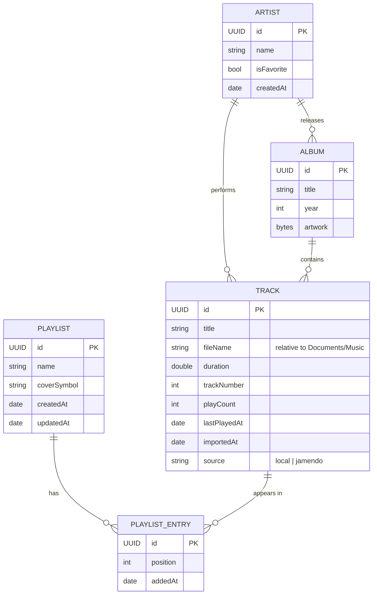

# Data Model

All data lives on the device in a **SwiftData** store. Audio files live in `Documents/Music/`. Both survive app re-installs as long as the app is not deleted and the bundle identifier does not change.

## 1. Entity-relationship diagram



`PLAYLIST_ENTRY` is a join entity so the **same song can appear in many playlists** and each playlist keeps its **own order**.

## 2. SwiftData models (sketch)

```swift
import Foundation
import SwiftData

@Model
final class Artist {
    @Attribute(.unique) var id: UUID
    var name: String
    var isFavorite: Bool
    var createdAt: Date
    @Relationship(inverse: \Track.artist) var tracks: [Track] = []
    @Relationship(inverse: \Album.artist) var albums: [Album] = []

    init(name: String) {
        self.id = UUID()
        self.name = name
        self.isFavorite = false
        self.createdAt = .now
    }
}

@Model
final class Album {
    @Attribute(.unique) var id: UUID
    var title: String
    var year: Int?
    @Attribute(.externalStorage) var artwork: Data?
    var artist: Artist?
    @Relationship(inverse: \Track.album) var tracks: [Track] = []

    init(title: String, artist: Artist?) {
        self.id = UUID()
        self.title = title
        self.artist = artist
    }
}

@Model
final class Track {
    @Attribute(.unique) var id: UUID
    var title: String
    var fileName: String
    var duration: Double
    var trackNumber: Int?
    var playCount: Int
    var lastPlayedAt: Date?
    var importedAt: Date
    var source: String
    var artist: Artist?
    var album: Album?
    @Relationship(deleteRule: .cascade, inverse: \PlaylistEntry.track) var entries: [PlaylistEntry] = []

    init(title: String, fileName: String, duration: Double) {
        self.id = UUID()
        self.title = title
        self.fileName = fileName
        self.duration = duration
        self.playCount = 0
        self.importedAt = .now
        self.source = "local"
    }
}

@Model
final class Playlist {
    @Attribute(.unique) var id: UUID
    var name: String
    var coverSymbol: String
    var createdAt: Date
    var updatedAt: Date
    @Relationship(deleteRule: .cascade, inverse: \PlaylistEntry.playlist) var entries: [PlaylistEntry] = []

    var orderedTracks: [Track] {
        entries.sorted { $0.position < $1.position }.compactMap(\.track)
    }

    init(name: String, coverSymbol: String = "music.note.list") {
        self.id = UUID()
        self.name = name
        self.coverSymbol = coverSymbol
        self.createdAt = .now
        self.updatedAt = .now
    }
}

@Model
final class PlaylistEntry {
    @Attribute(.unique) var id: UUID
    var position: Int
    var addedAt: Date
    var playlist: Playlist?
    var track: Track?

    init(position: Int, playlist: Playlist, track: Track) {
        self.id = UUID()
        self.position = position
        self.addedAt = .now
        self.playlist = playlist
        self.track = track
    }
}
```

## 3. File storage

```text
<App sandbox>/
└── Documents/                 ← visible in the Files app (UIFileSharingEnabled)
    ├── Music/
    │   ├── artist-name - song-title.mp3
    │   └── ...
    └── Backups/
        └── corymusic-backup-2026-09-14.json
```

- Tracks store a **relative** `fileName`, never an absolute path — the sandbox path can change between installs.
- Duplicate detection: same file name **and** duration (± 1 s).

## 4. Backup format (JSON)

Backups contain **metadata only**, never audio. On restore, entries are matched to existing tracks by `fileName` + `duration`.

```json
{
  "app": "CoryMusic",
  "schemaVersion": 1,
  "exportedAt": "2026-09-14T18:30:00Z",
  "artists": [
    { "name": "Artist Name", "isFavorite": true }
  ],
  "tracks": [
    {
      "title": "Song Title",
      "artist": "Artist Name",
      "album": "Album Title",
      "fileName": "artist-name - song-title.mp3",
      "duration": 215.4
    }
  ],
  "playlists": [
    {
      "name": "My Favorites",
      "coverSymbol": "heart.fill",
      "tracks": ["artist-name - song-title.mp3"]
    }
  ]
}
```

A ready-to-edit template lives in [`playlists/my-playlist.example.json`](../playlists/my-playlist.example.json).
