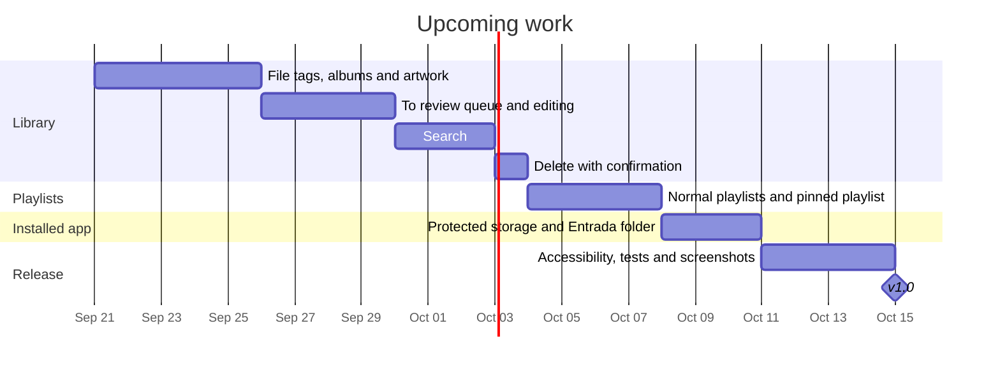

# Roadmap

Pace: about **24 hours per week**. Dates for upcoming phases are estimates.

## Done

| Milestone | Scope | Status |
|---|---|---|
| **Analysis & design** | Requirements, design system, icon, brand, documentation site | ✅ |
| **v0.1 Foundations** | Expo SDK 57 app, native Liquid Glass tabs, design tokens, English and Spanish | ✅ |
| **v0.2 Profile & library** | Welcome with greeting, profile (photo, name, language, stats), import from Files, SQLite library, songs and artists, play and pause | ✅ |
| **v0.3 Smart playlists** | Rules engine, editor with live preview, detail screen, four suggestions, favorites, play counting | ✅ |
| **v0.4 Music folder** | Choose, sync, change and forget a music folder, including subfolders | ✅ |
| **v0.5 Backup & installed app** | Save and restore backups, weekly automatic backups, pending songs; background audio and Lock Screen details for the installed app; install guide | ✅ |
| **v0.6 Now Playing** | Full-screen player, mini player, queue, shuffle, repeat, sleep timer, Play and Shuffle buttons, Lock Screen controls | ✅ |

## Next

| Version | Scope |
|---|---|
| **v0.7** | Albums and artwork from tags, To review, search, delete |
| **v0.8** | Normal playlists, pinned playlist |
| **v0.9** | Protected storage for imported songs and the automatic Entrada folder |
| **v1.0** | Accessibility pass, tests and final screenshots |

## GitHub workflow

- Public repository; every push to `main` also updates the [documentation site](https://sabrinasalomon.github.io/CoryMusic/).
- Run `npx tsc --noEmit` and `npx expo-doctor` in `mobile/` before each commit.
- Commits are authored only by sabrinasalomon, with no third-party attribution.
