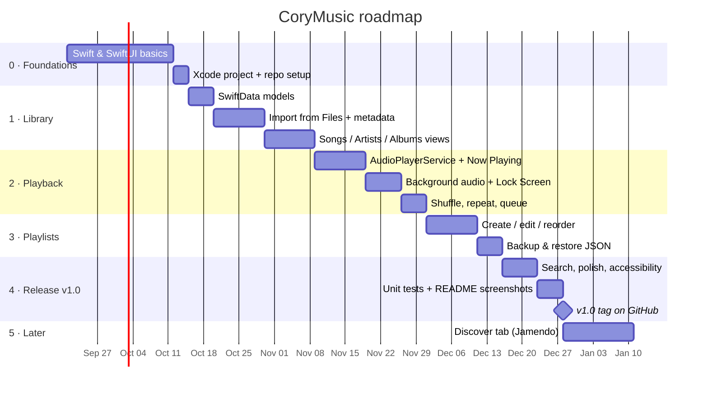

# Roadmap

Estimates assume **part-time work (~10 hours/week)**. Dates are targets, not promises.

## Timeline

## Milestones

| Version | Scope | Done when |
|---|---|---|
| **v0.1** | Project + models | App runs on iPhone with an empty library |
| **v0.2** | Library | Songs imported from Files appear by artist and album |
| **v0.3** | Playback | Music keeps playing with the phone locked; Lock Screen controls work |
| **v0.4** | Playlists | Your playlist of favorite artists is built and reordered in the app |
| **v1.0** | Release | Backup/restore, search, accessibility, tests, screenshots in README |
| **v1.1** | Discover | Browse and play Creative Commons music from Jamendo |

## GitHub workflow
- One **issue** per feature (use the FR IDs from [REQUIREMENTS.md](REQUIREMENTS.md)).
- A **GitHub Project** board: *Backlog → In progress → Done*.
- Branch per feature (`feature/import-files`), merge with a pull request.
- Tag each milestone (`v0.1`, `v0.2`, …) and add screenshots/GIFs to the release notes.

## Backlog (ideas)
- Sleep timer
- Equalizer presets
- Lyrics you write yourself, stored locally
- Home Screen widget (Now Playing)
- Siri Shortcuts: "Play my favorites"
- CarPlay-style large controls mode
