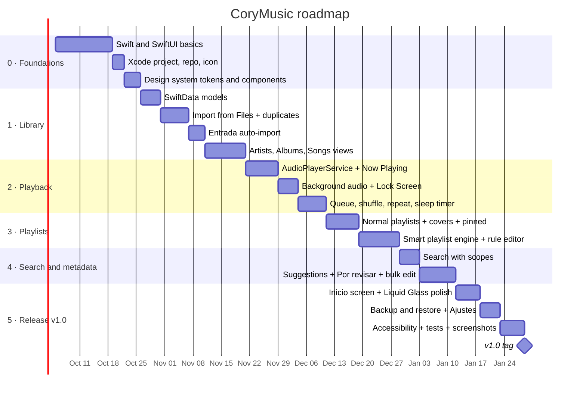

# Roadmap

Estimates assume **part-time work (~10 hours/week)**. Development starts only after the analysis phase is approved; dates below are placeholders counted from that start.

## Timeline

## Milestones

| Version | Scope | Done when |
|---|---|---|
| **v0.1** | Foundations | App runs on iPhone with the tab bar, black/purple design system and icon |
| **v0.2** | Library | Songs from Files and Entrada appear by artist, album and song |
| **v0.3** | Playback | Music plays with the phone locked; queue and sleep timer work |
| **v0.4** | Playlists | Normal and smart playlists, including *Lo nuevo de [Artista]* |
| **v0.5** | Search & metadata | Search works; incomplete songs can be fixed with suggestions |
| **v1.0** | Release | Inicio, backup/restore, Ajustes, accessibility, tests, README screenshots |

## GitHub workflow
- One **issue** per requirement (FR IDs from [REQUIREMENTS.md](REQUIREMENTS.md)).
- **GitHub Project** board: *Backlog → In progress → Done*.
- Branch per feature (`feature/smart-playlists`), merge with a pull request.
- Tag milestones and attach screenshots or screen recordings to releases.

## After v1.0 (ideas, all on-device)
- On-device AI metadata suggestions (Foundation Models) if not done in v0.5
- Home Screen widget and Control Center control
- Siri / Shortcuts: "Reproducir mis favoritas"
- Equalizer presets
- Lyrics editor improvements
