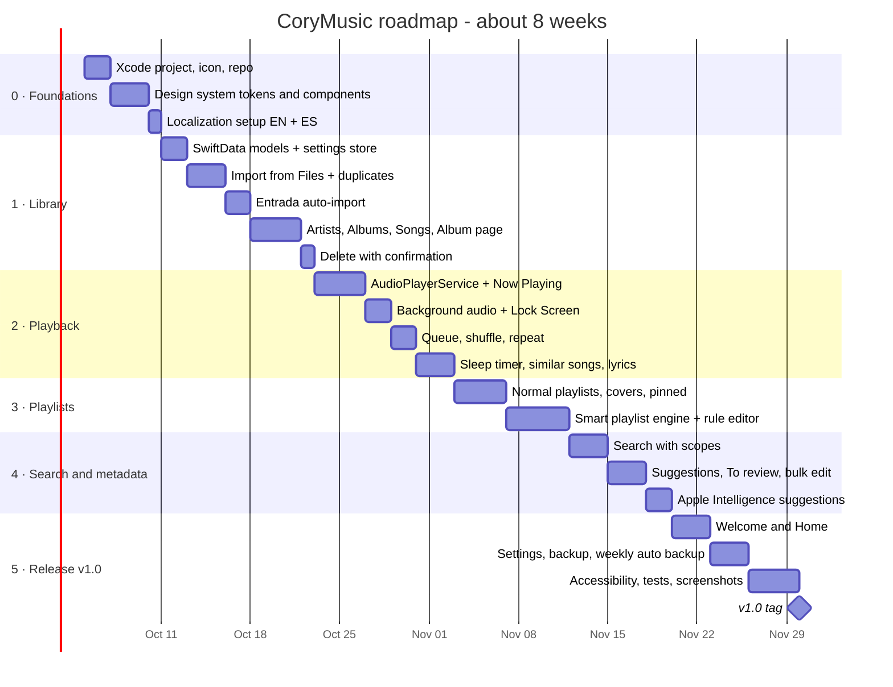

# Roadmap

Estimates assume **~24 hours per week**. Development starts only after the analysis phase is approved; dates below are placeholders counted from that start.

## Timeline

## Milestones

| Version | Scope | Done when |
|---|---|---|
| **v0.1** | Foundations | App runs on the iPhone 17 with tab bar, icon, black/purple design system, English and Spanish |
| **v0.2** | Library | Songs from Files and Entrada appear by artist, album and song; delete with confirmation works |
| **v0.3** | Playback | Music plays with the phone locked; queue, sleep timer, lyrics and similar songs work |
| **v0.4** | Playlists | Normal and smart playlists, including *New from [Artist]* |
| **v0.5** | Search & metadata | Search works; incomplete songs fixed with rules and Apple Intelligence suggestions |
| **v1.0** | Release | Welcome, Home, Settings, weekly backup and restore, accessibility, tests, README screenshots |

## GitHub workflow
- Public repository `sabrinasalomon/CoryMusic`, created when development starts.
- One **issue** per requirement (FR IDs from [REQUIREMENTS.md](REQUIREMENTS.md)).
- **GitHub Project** board: *Backlog → In progress → Done*.
- Branch per feature (`feature/smart-playlists`), merge with a pull request.
- Tag milestones and attach screenshots or screen recordings to releases.
- Commits authored only by sabrinasalomon, with no third-party attribution.

## After v1.0 (ideas, all on-device)
- Home Screen widget and Control Center control
- Siri / Shortcuts: "Play my favorites"
- Equalizer presets
- Lyrics editor improvements
