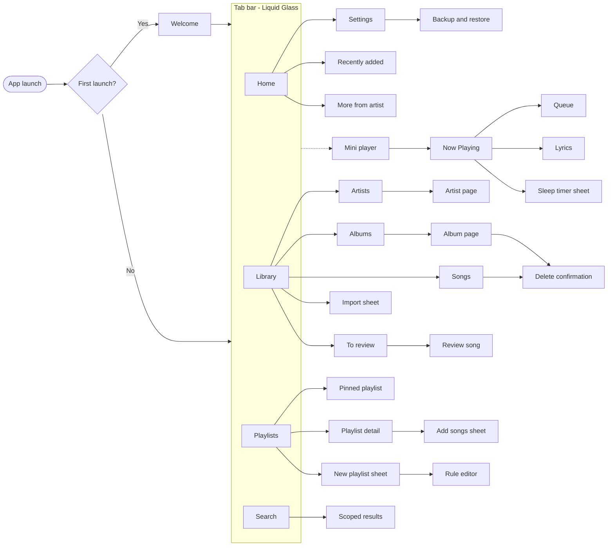
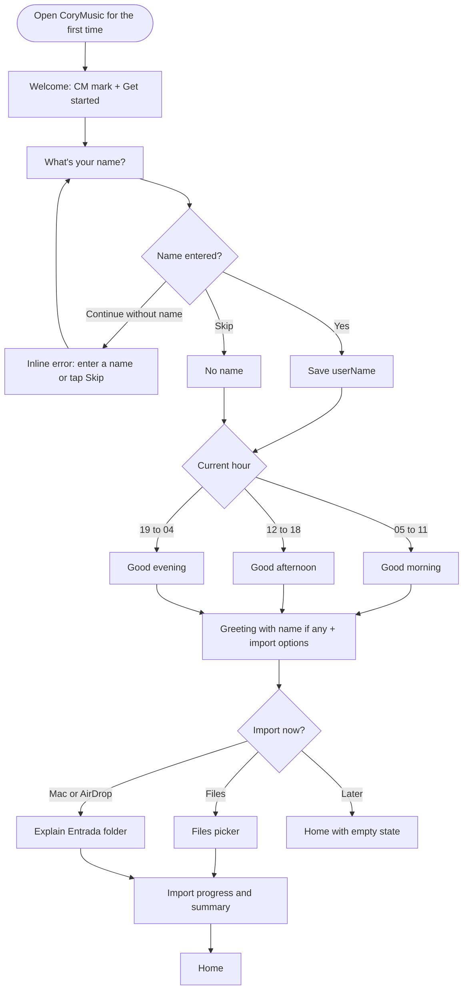
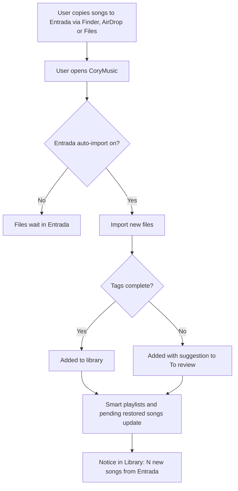
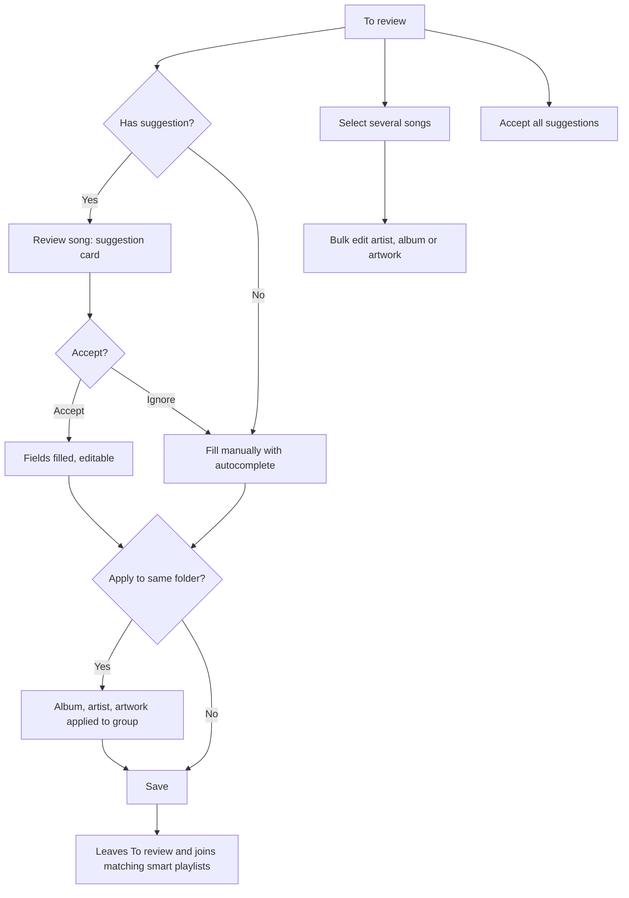
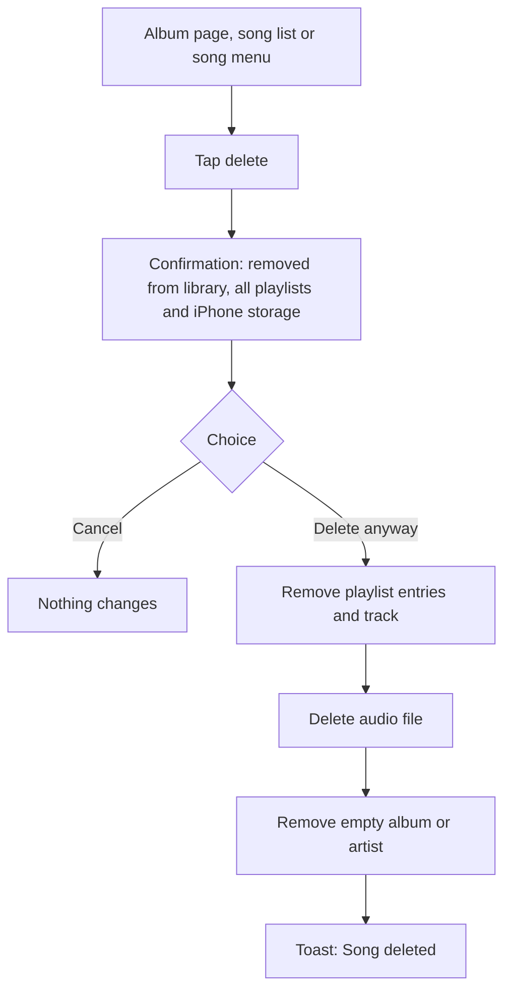
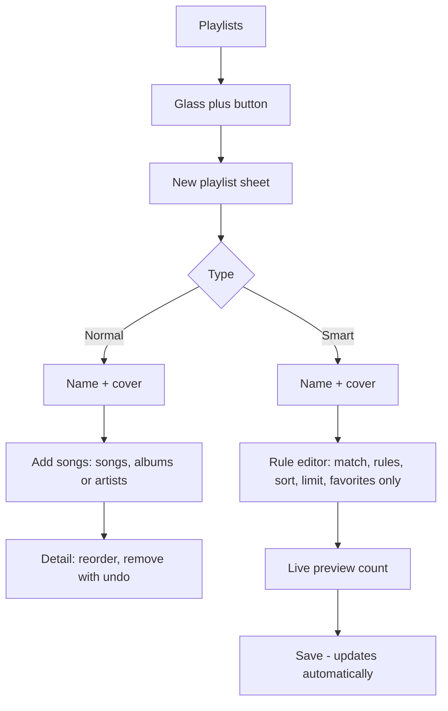
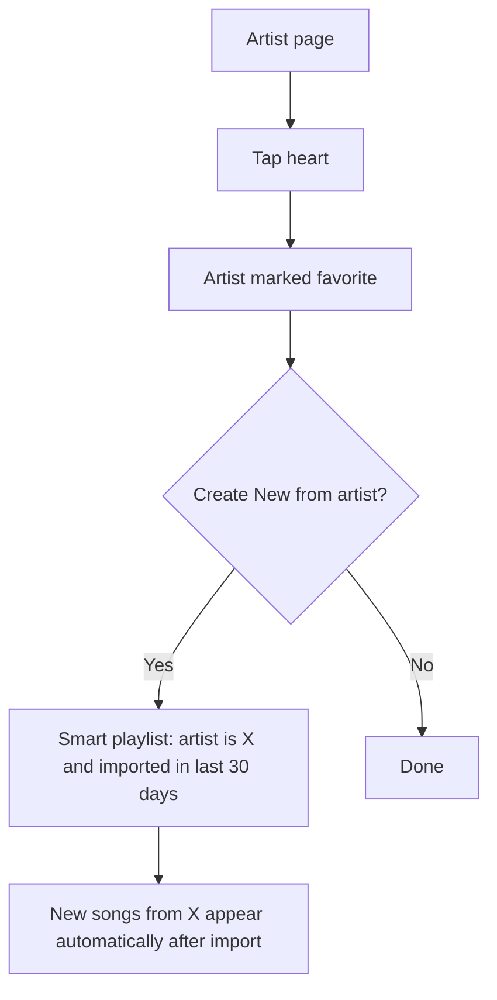
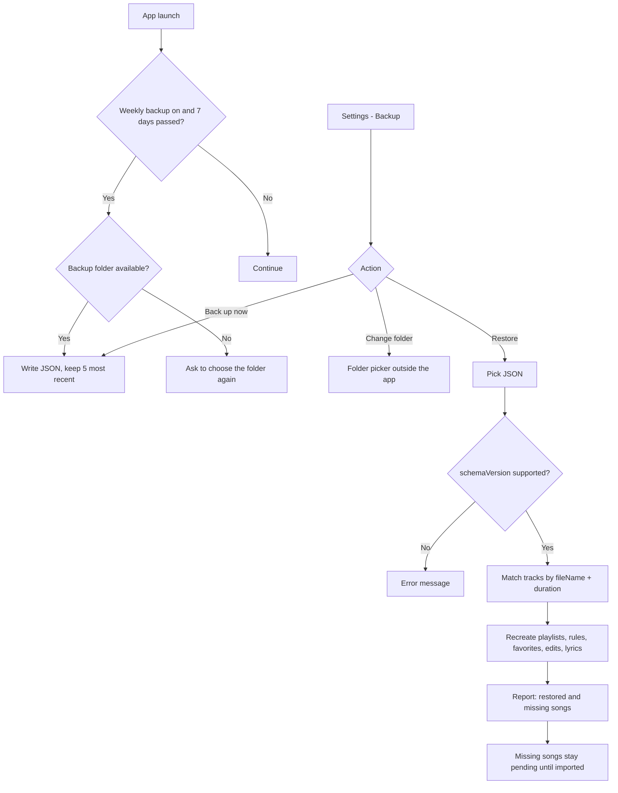

# User Flows

UI labels follow the glossary in [DESIGN.md](DESIGN.md#9-naming-glossary-ui-copy). Diagrams use the English (base) names.

## 1. Screen map

## 2. Welcome (first launch)

## 3. Automatic import from Entrada

## 4. Fix incomplete songs

## 5. Delete a song

## 6. Create a playlist

## 7. Favorite artist to smart playlist

## 8. Backup & restore

