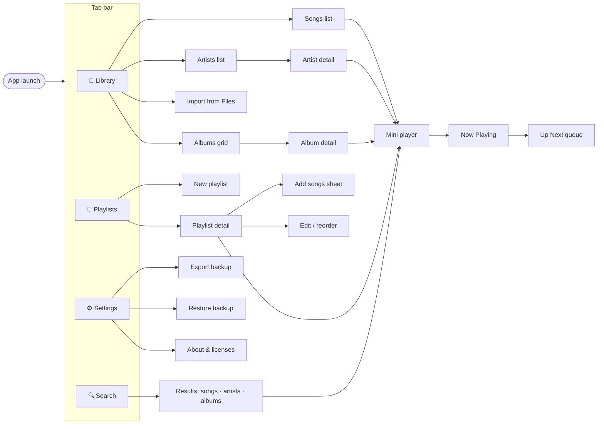
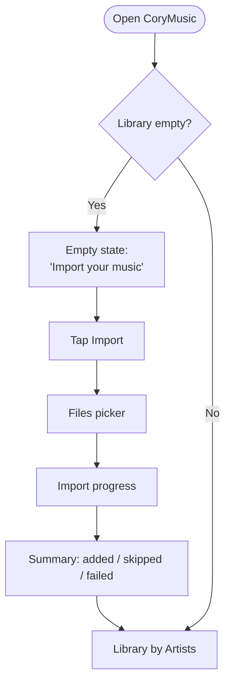
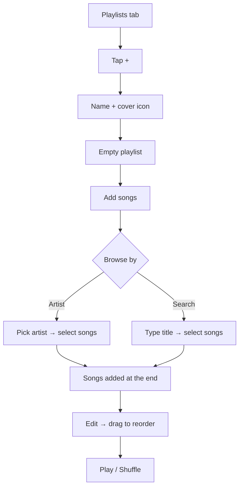
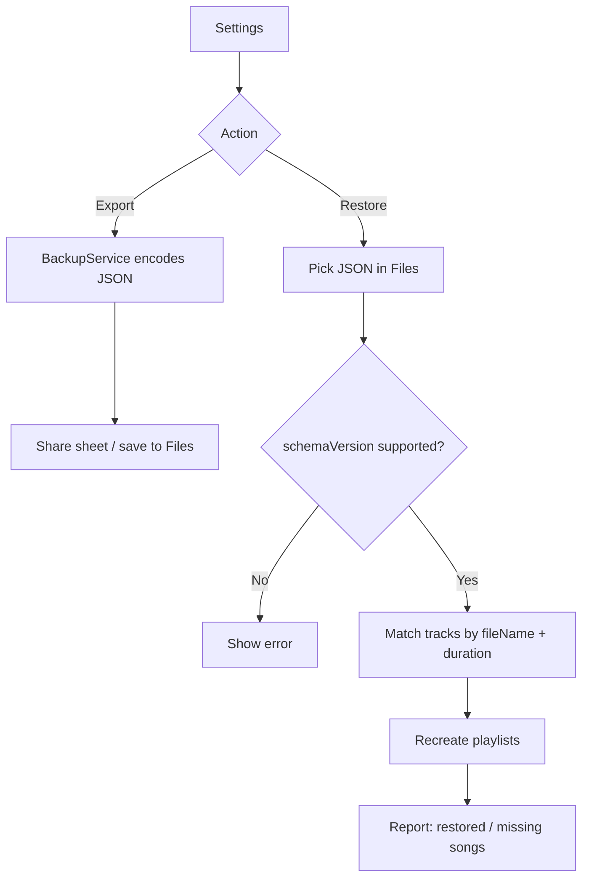

# User Flows

## 1. Screen map

## 2. First launch

## 3. Build a playlist with your favorite artists

## 4. Backup & restore

## 5. Screens checklist

| Screen | Main components |
|---|---|
| Library | Segmented control (Songs · Artists · Albums), Import button, list/grid |
| Artist detail | Header with name + favorite toggle, Play / Shuffle, songs list |
| Playlist detail | Cover, name, song count & total time, Play / Shuffle, editable list |
| Now Playing | Artwork, title/artist, progress slider, controls, shuffle/repeat, queue button |
| Mini player | Artwork thumbnail, title, play/pause, next — pinned above the tab bar |
| Settings | Backup, Restore, storage used, About |
