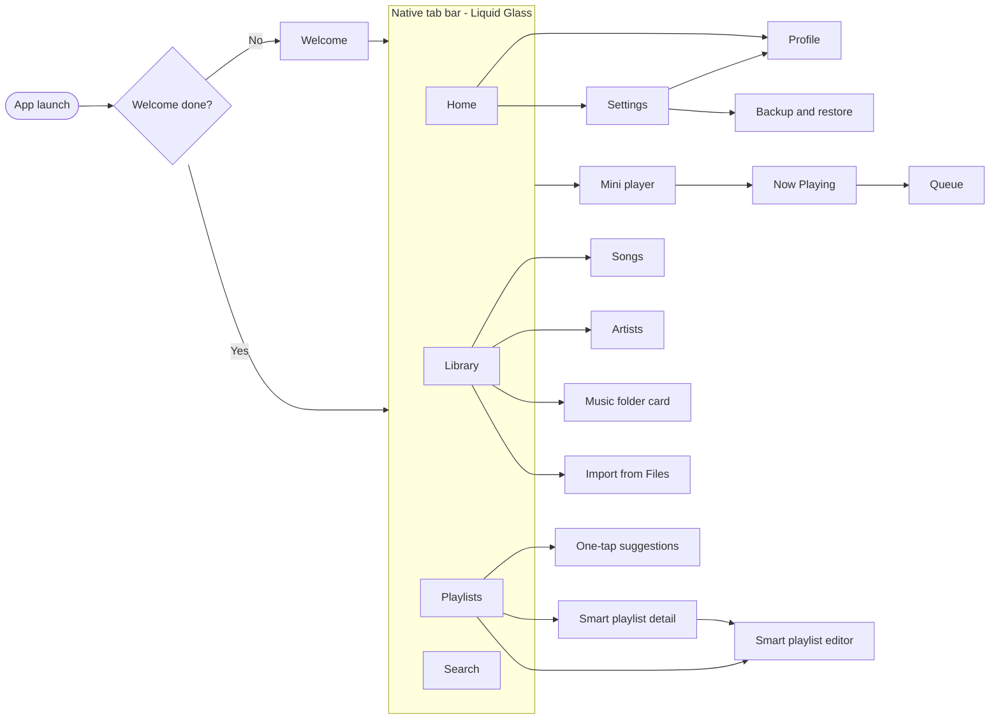
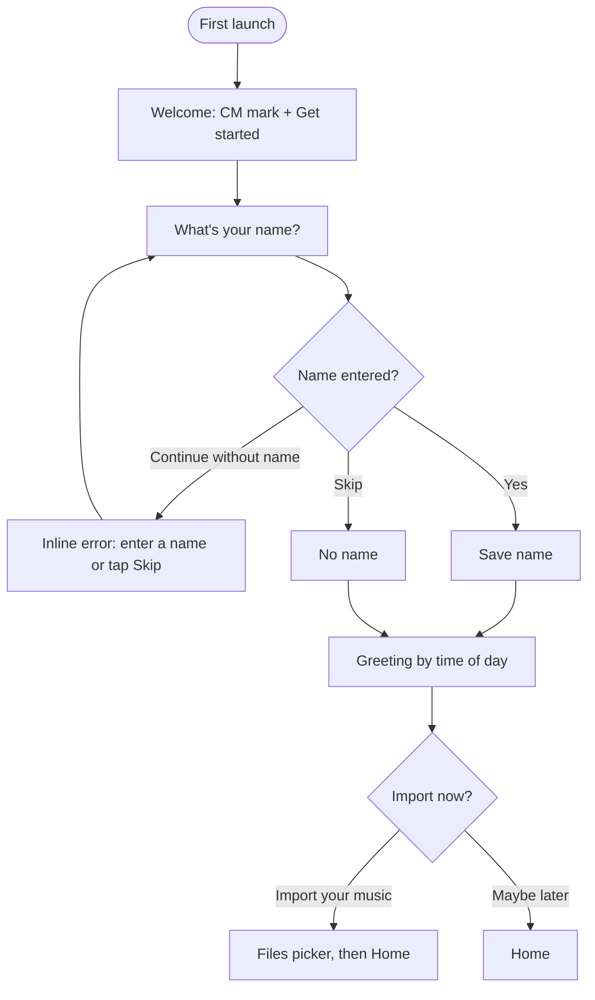
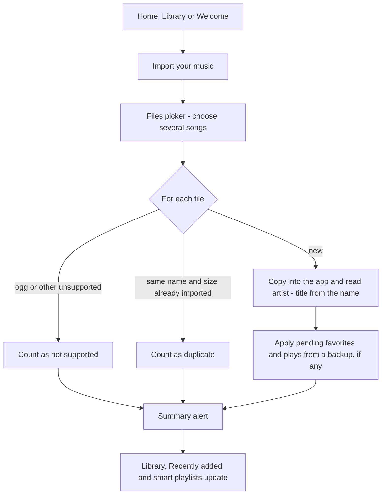
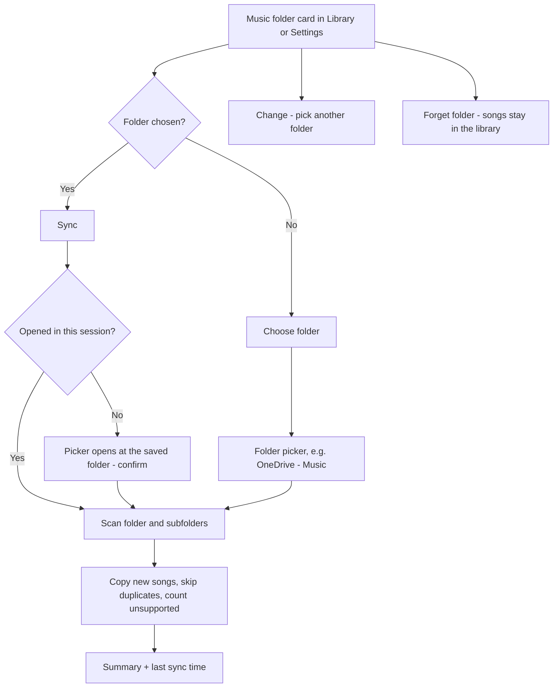
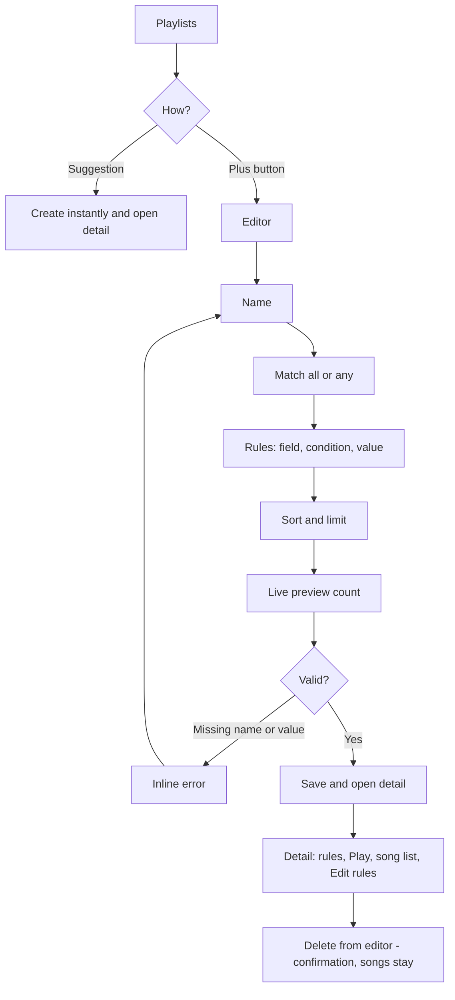
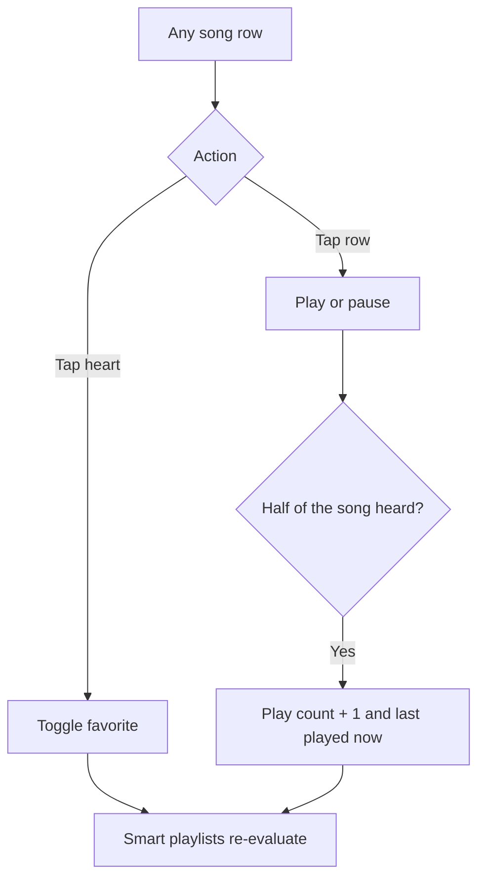
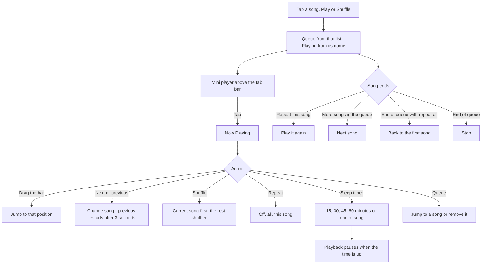
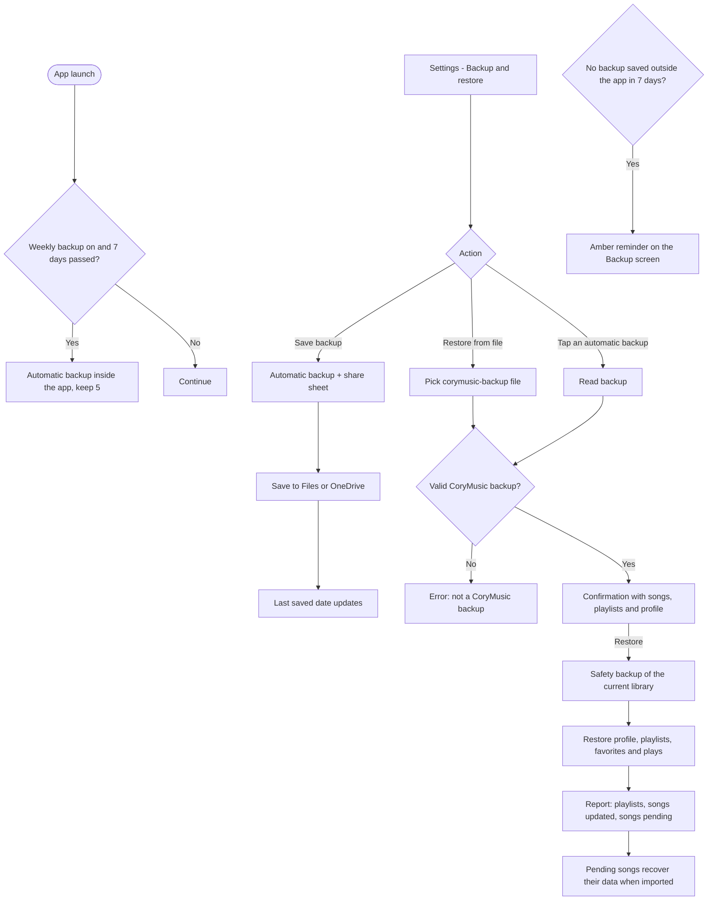

# User Flows

UI labels follow the glossary in [DESIGN.md](DESIGN.md#9-naming-glossary-ui-copy). Diagrams use the English names. Flows marked *planned* are not implemented yet.

## 1. Screen map

## 2. Welcome

## 3. Import from Files

## 4. Music folder sync

## 5. Smart playlists

## 6. Favorites and plays

## 7. Now Playing

## 8. Backup and restore

## 9. Planned flows

| Flow | Summary |
|---|---|
| Lyrics | Write or paste lyrics and read them from Now Playing |
| Delete a song | Confirmation, then remove from library, playlists and storage |
| To review | Complete missing song data with suggestions |
| Entrada folder | Automatic import from CoryMusic's own folder in Files |
