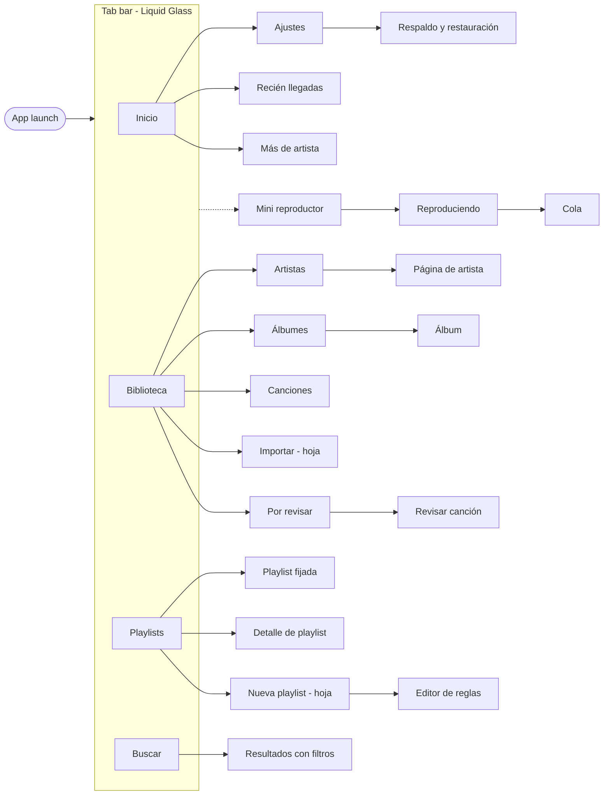
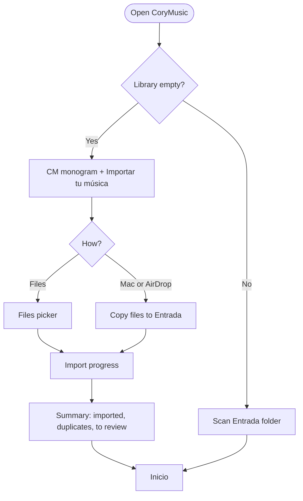
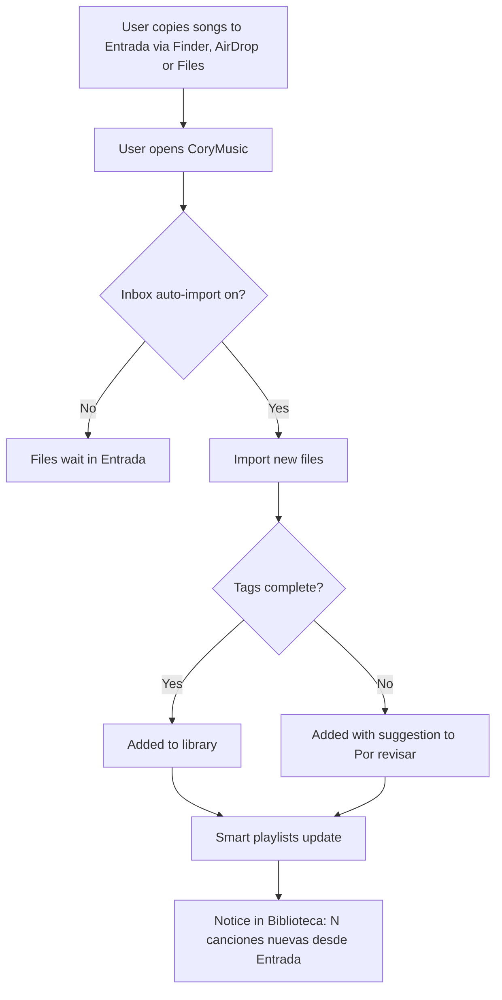
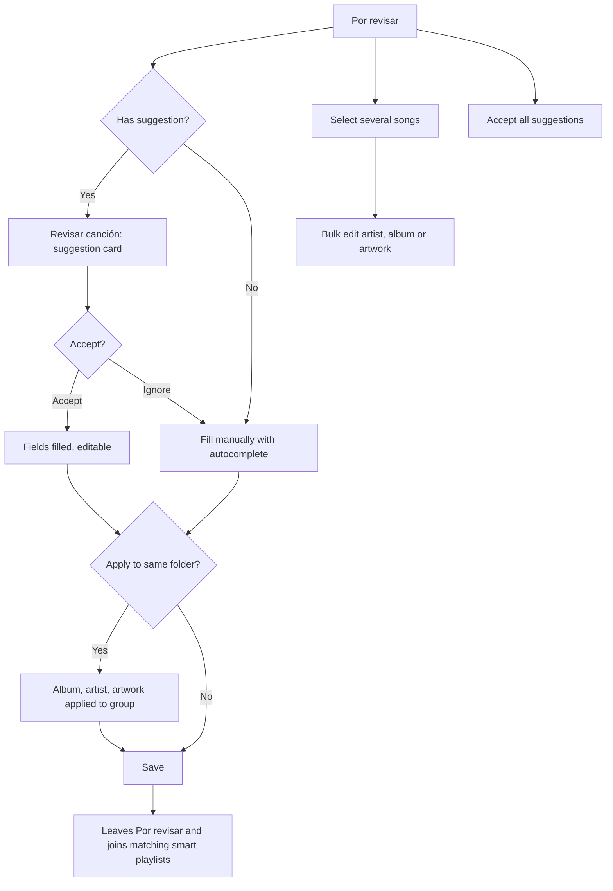
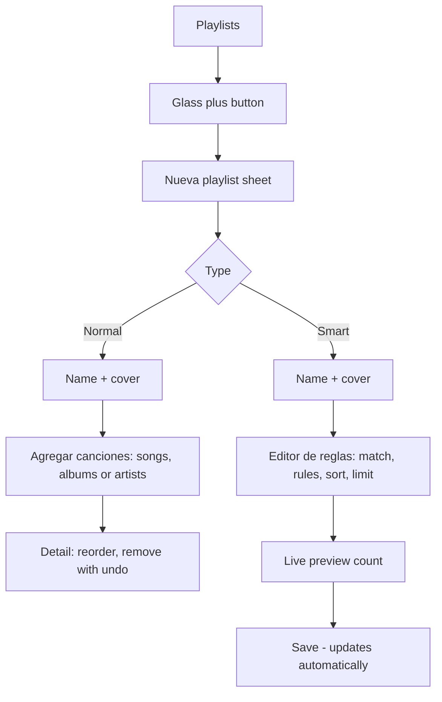
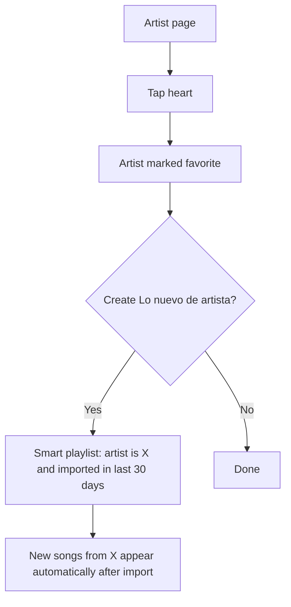
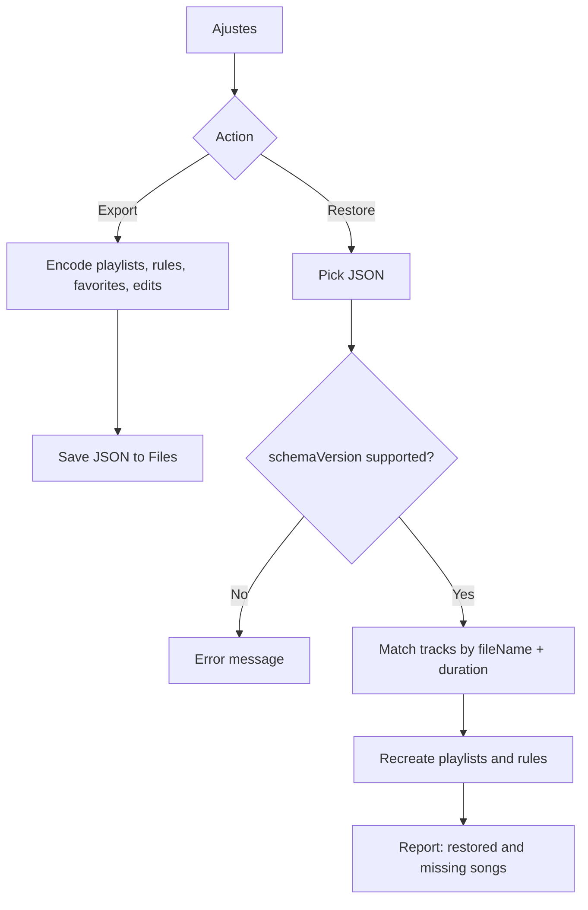

# User Flows

UI labels follow the glossary in [DESIGN.md](DESIGN.md#9-naming-glossary-ui-copy).

## 1. Screen map

## 2. First launch

## 3. Automatic import from Entrada

## 4. Fix incomplete songs

## 5. Create a playlist

## 6. Favorite artist to smart playlist

## 7. Backup & restore

